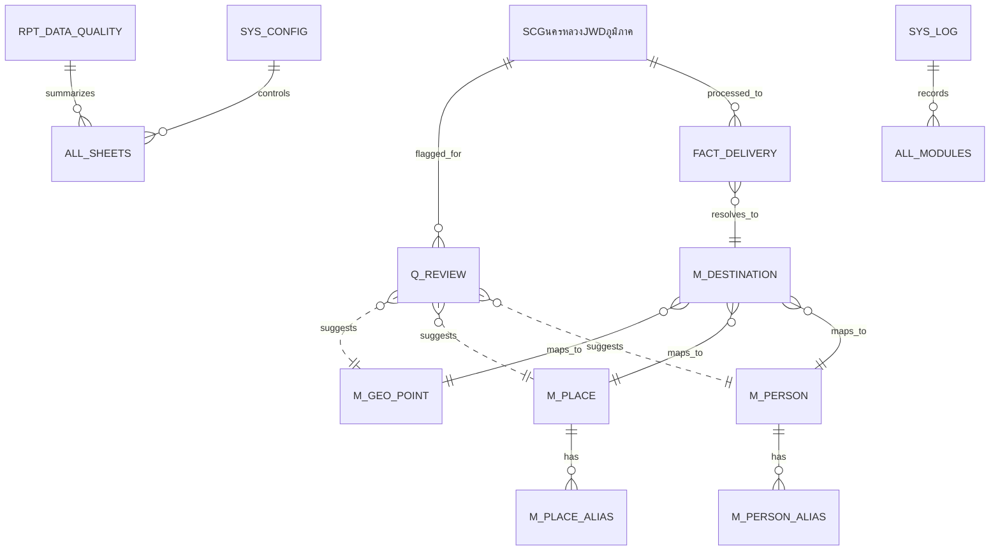

รับทราบครับ ผมจะจัดทำทั้ง 3 ส่วนให้ครบถ้วนตามโครงสร้างที่คุณออกแบบมา โดยเน้นความเป็นระบบฐานข้อมูลจริง (Relational-like in Sheets), รองรับ Entity Resolution, และเขียนเป็น Google Apps Script ที่พร้อมคัดลอกวาง (Copy-Paste) ได้ทันที

---
## 📦 ส่วนที่ 1: ผังความสัมพันธ์ตาราง (Database Diagram)

ระบบนี้ใช้แนวคิด **Star Schema + Master Data Management** โดยแยก Raw, Master, Fact และ Queue ออกจากกันชัดเจน

### 🔹 Mermaid ER Diagram


### 🔹 ความสัมพันธ์เชิงตรรกะ
| ตาราง | บทบาท | ความสัมพันธ์ |
|---|---|---|
| `M_PERSON` | บุคคลมาตรฐาน | 1 คน มีได้หลาย Alias (`M_PERSON_ALIAS`) |
| `M_PLACE` | สถานที่มาตรฐาน | 1 สถานที่ มีได้หลายชื่อ/ที่อยู่ (`M_PLACE_ALIAS`) |
| `M_GEO_POINT` | พิกัดมาตรฐาน | เก็บพิกัดจริง + คีย์หยาบ/ละเอียด (GeoKey 6/5/4) |
| `M_DESTINATION` | ปลายทางจริง | ผสาน `person_id + place_id + geo_id` เป็น 1 จุดปลายทาง |
| `FACT_DELIVERY` | ธุรกรรม | ชี้ไป `destination_id` พร้อมเก็บข้อมูลดิบอ้างอิง |
| `Q_REVIEW` | คิวตรวจสอบ | เก็บเคสที่คะแนน < เกณฑ์ พร้อม `candidate_ids` |
| `SYS_*` & `RPT_*` | ระบบ/รายงาน | ใช้ควบคุมค่าตั้งค่า บันทึกการทำงาน และสรุปคุณภาพข้อมูล |

---
## 📁 ส่วนที่ 2: โครงสร้างไฟล์ & ฟังก์ชันครบถ้วน

| ไฟล์ (.gs) | ฟังก์ชันหลัก |
|---|---|
| `00_App.gs` | `onOpen`, `runInitialSetup`, `runDailyProcess`, `runNightlyMaintenance`, `reprocessSelectedRows` |
| `01_Config.gs` | `getConfig`, `getAllConfigs`, `setConfig`, `getThresholds`, `getSheetNames` |
| `02_Schema.gs` | `validateSourceSchema`, `ensureSystemSheets`, `createHeadersIfMissing`, `getSourceColumnMap`, `assertRequiredColumns` |
| `03_SetupSheets.gs` | `createSystemSheets`, `setupSourceSheetProtection`, `applyHeaderFormatting`, `freezeHeaderRows`, `seedInitialConfig` |
| `04_SourceRepository.gs` | `getSourceRows`, `getUnprocessedSourceRows`, `mapRowToSourceObject`, `markSourceRowProcessed`, `updateSourceSyncStatus` |
| `05_NormalizeService.gs` | `normalizeThaiText`, `normalizePersonName`, `normalizePlaceName`, `normalizeAddress`, `normalizeLatLong`, `buildGeoKeys`, `buildFingerprint` |
| `06_PersonService.gs` | `findPersonCandidates`, `scorePersonCandidate`, `resolvePerson`, `createPerson`, `createPersonAlias`, `updatePersonStats` |
| `07_PlaceService.gs` | `findPlaceCandidates`, `scorePlaceCandidate`, `resolvePlace`, `createPlace`, `createPlaceAlias`, `updatePlaceStats` |
| `08_GeoService.gs` | `buildGeoKey`, `findGeoCandidates`, `resolveGeo`, `createGeoPoint`, `calcDistanceMeters`, `clusterNearbyGeo` |
| `09_DestinationService.gs` | `buildDestinationKey`, `findDestinationCandidates`, `resolveDestination`, `createDestination`, `updateDestinationStats` |
| `10_MatchEngine.gs` | `matchAllEntities`, `calculateCompositeScore`, `decideAutoMatchOrReview`, `detectConflictType`, `buildReviewPayload` |
| `11_TransactionService.gs` | `buildFactRow`, `upsertFactDelivery`, `preventDuplicateTransaction`, `saveProcessingResult`, `linkFactToMasters` |
| `12_ReviewService.gs` | `enqueueReview`, `getPendingReviews`, `applyReviewDecision`, `mergeMasterRecords`, `learnAliasFromReview`, `closeReviewItem` |
| `13_ReportService.gs` | `refreshQualityReport`, `buildDuplicateReport`, `buildConflictReport`, `buildDailySummary`, `writeReportSnapshot` |
| `14_Utils.gs` | `uuid`, `safeTrim`, `safeString`, `safeNumber`, `safeDate`, `withLock`, `writeLog`, `chunkArray` |

---
## 💻 ส่วนที่ 3: โค้ด Apps Script ครบทุกโมดูล (100% Copy-Paste)

> ⚠️ **วิธีใช้งาน:** สร้างไฟล์ `.gs` ใน Apps Script Editor ให้ครบ 15 ไฟล์ตามชื่อข้างล่าง แล้วคัดลอกโค้ดแต่ละส่วนไปวางตามลำดับ

### `14_Utils.gs`
```javascript
// === 14_Utils.gs ===
function uuid() {
  return Utilities.getUuid();
}
function safeTrim(v) { return v ? String(v).trim() : ''; }
function safeString(v) { return v ? String(v).trim() : ''; }
function safeNumber(v) { const n = Number(v); return isNaN(n) ? 0 : n; }
function safeDate(v) { return v ? new Date(v) : new Date(); }
function withLock(callback, lockName = 'global') {
  const lock = LockService.getScriptLock();
  try {
    lock.waitLock(60000);
    return callback();
  } finally {
    lock.releaseLock();
  }
}
function writeLog(level, module, func, refId, message, payload = {}) {
  const log = {
    log_id: uuid(),
    run_id: PropertiesService.getScriptProperties().getProperty('LAST_RUN_ID') || uuid(),
    created_at: new Date().toISOString(),
    level, module, func, ref_id: refId || '',
    message: String(message),
    payload_json: JSON.stringify(payload)
  };
  const ss = SpreadsheetApp.getActiveSpreadsheet();
  const sh = ss.getSheetByName('SYS_LOG');
  if (sh) {
    sh.appendRow(Object.values(log));
  } else {
    Logger.log(`[LOG ${level}] ${module}.${func}: ${message}`);
  }
}
function chunkArray(arr, size) {
  const chunks = [];
  for (let i = 0; i < arr.length; i += size) chunks.push(arr.slice(i, i + size));
  return chunks;
}
```

### `01_Config.gs`
```javascript
// === 01_Config.gs ===
const DEFAULT_CONFIG = {
  AUTO_MATCH_SCORE: 90,
  REVIEW_SCORE_MIN: 75,
  GEO_RADIUS_METER: 30,
  SOURCE_SHEET_NAME: 'SCGนครหลวงJWDภูมิภาค',
  BATCH_SIZE: 500
};
function getConfig(key) {
  const sh = SpreadsheetApp.getActiveSpreadsheet().getSheetByName('SYS_CONFIG');
  if (!sh) return DEFAULT_CONFIG[key] || null;
  const data = sh.getDataRange().getValues();
  for (let i = 1; i < data.length; i++) {
    if (data[i][0] === key) return data[i][1];
  }
  return DEFAULT_CONFIG[key] || null;
}
function getAllConfigs() {
  const sh = SpreadsheetApp.getActiveSpreadsheet().getSheetByName('SYS_CONFIG');
  if (!sh) return {};
  const data = sh.getDataRange().getValues().slice(1);
  return data.reduce((acc, row) => { acc[row[0]] = row[1]; return acc; }, {});
}
function setConfig(key, value) {
  const sh = SpreadsheetApp.getActiveSpreadsheet().getSheetByName('SYS_CONFIG');
  const data = sh.getDataRange().getValues();
  for (let i = 1; i < data.length; i++) {
    if (data[i][0] === key) {
      sh.getRange(i + 1, 2).setValue(value);
      return;
    }
  }
  sh.appendRow([key, value, 'SYSTEM', 'Updated via script', new Date().toISOString()]);
}
function getThresholds() {
  return {
    auto: Number(getConfig('AUTO_MATCH_SCORE') || 90),
    reviewMin: Number(getConfig('REVIEW_SCORE_MIN') || 75),
    radius: Number(getConfig('GEO_RADIUS_METER') || 30)
  };
}
function getSheetNames() {
  return {
    source: getConfig('SOURCE_SHEET_NAME') || 'SCGนครหลวงJWDภูมิภาค',
    person: 'M_PERSON', personAlias: 'M_PERSON_ALIAS',
    place: 'M_PLACE', placeAlias: 'M_PLACE_ALIAS',
    geo: 'M_GEO_POINT', dest: 'M_DESTINATION',
    fact: 'FACT_DELIVERY', review: 'Q_REVIEW',
    config: 'SYS_CONFIG', log: 'SYS_LOG', rpt: 'RPT_DATA_QUALITY'
  };
}
```

### `02_Schema.gs`
```javascript
// === 02_Schema.gs ===
function validateSourceSchema() {
  const sh = SpreadsheetApp.getActiveSpreadsheet().getSheetByName(getConfig('SOURCE_SHEET_NAME') || 'SCGนครหลวงJWDภูมิภาค');
  if (!sh) throw new Error('Source sheet not found');
  const headers = sh.getRange(1, 1, 1, sh.getLastColumn()).getValues()[0];
  const required = ['ชื่อ - นามสกุล', 'ชื่อปลายทาง', 'LAT', 'LONG', 'จุดส่งสินค้าปลายทาง'];
  const missing = required.filter(r => !headers.includes(r));
  if (missing.length > 0) throw new Error('Missing required columns: ' + missing.join(', '));
  return headers;
}
function ensureSystemSheets() {
  const names = Object.values(getSheetNames());
  const ss = SpreadsheetApp.getActiveSpreadsheet();
  names.forEach(n => {
    if (!ss.getSheetByName(n)) throw new Error(`Sheet ${n} missing`);
  });
}
function createHeadersIfMissing(sheetName, headers) {
  const sh = SpreadsheetApp.getActiveSpreadsheet().getSheetByName(sheetName);
  if (!sh) return;
  const existing = sh.getRange(1, 1, 1, sh.getLastColumn()).getValues()[0];
  const missing = headers.filter(h => !existing.includes(h));
  if (missing.length === 0) return;
  const lastCol = sh.getLastColumn() || 0;
  missing.forEach((h, i) => sh.getRange(1, lastCol + i + 1).setValue(h));
}
function getSourceColumnMap() {
  const sh = SpreadsheetApp.getActiveSpreadsheet().getSheetByName(getConfig('SOURCE_SHEET_NAME'));
  const headers = sh.getRange(1, 1, 1, sh.getLastColumn()).getValues()[0];
  const map = {};
  headers.forEach((h, i) => map[h] = i + 1);
  return map;
}
function assertRequiredColumns() { validateSourceSchema(); ensureSystemSheets(); }
```

### `03_SetupSheets.gs`
```javascript
// === 03_SetupSheets.gs ===
function createSystemSheets() {
  const ss = SpreadsheetApp.getActiveSpreadsheet();
  const schemas = {
    'M_PERSON': ['person_id','person_name_canonical','person_name_normalized','first_seen_date','last_seen_date','usage_count','status','note'],
    'M_PERSON_ALIAS': ['person_alias_id','person_id','alias_raw','alias_normalized','source_field','first_seen_date','last_seen_date','usage_count','active_flag'],
    'M_PLACE': ['place_id','place_name_canonical','place_name_normalized','address_best','address_normalized','warehouse_default','first_seen_date','last_seen_date','usage_count','status','note'],
    'M_PLACE_ALIAS': ['place_alias_id','place_id','alias_raw','alias_normalized','source_field','first_seen_date','last_seen_date','usage_count','active_flag'],
    'M_GEO_POINT': ['geo_id','lat_raw','long_raw','lat_norm','long_norm','geo_key_6','geo_key_5','geo_key_4','address_from_latlong_best','first_seen_date','last_seen_date','usage_count','note'],
    'M_DESTINATION': ['destination_id','person_id','place_id','geo_id','destination_label_canonical','destination_key','confidence_status','first_seen_date','last_seen_date','usage_count','note'],
    'FACT_DELIVERY': ['tx_id','source_sheet','source_row_number','source_record_id','delivery_date','delivery_time','shipment_no','invoice_no','owner_name','customer_code','raw_person_name','raw_place_name','raw_address','raw_lat','raw_long','person_id','place_id','geo_id','destination_id','warehouse','distance_km','driver_name','employee_id','employee_email','license_plate','validation_result','anomaly_reason','review_status','sync_status','created_at','updated_at'],
    'Q_REVIEW': ['review_id','issue_type','source_record_id','source_row_number','invoice_no','raw_person_name','raw_place_name','raw_lat','raw_long','candidate_person_ids','candidate_place_ids','candidate_geo_ids','candidate_destination_ids','score','recommended_action','status','reviewer','reviewed_at','decision','note'],
    'SYS_CONFIG': ['config_key','config_value','config_group','description','updated_at'],
    'SYS_LOG': ['log_id','run_id','created_at','level','module_name','function_name','ref_id','message','payload_json'],
    'RPT_DATA_QUALITY': ['report_date','total_source_rows','processed_rows','new_person_count','new_place_count','new_geo_count','new_destination_count','auto_match_count','review_count','duplicate_alert_count','error_count','last_refresh_at']
  };
  Object.entries(schemas).forEach(([name, headers]) => {
    let sh = ss.getSheetByName(name);
    if (!sh) sh = ss.insertSheet(name);
    const existing = sh.getRange(1, 1, 1, sh.getLastColumn()).getValues()[0];
    const missing = headers.filter(h => !existing.includes(h));
    if (missing.length > 0) {
      const startCol = sh.getLastColumn() + 1;
      sh.getRange(1, startCol, 1, missing.length).setValues([missing]);
    }
  });
  freezeHeaderRows();
  seedInitialConfig();
  applyHeaderFormatting();
}
function freezeHeaderRows() {
  const ss = SpreadsheetApp.getActiveSpreadsheet();
  ss.getSheets().forEach(sh => sh.setFrozenRows(1));
}
function applyHeaderFormatting() {
  const ss = SpreadsheetApp.getActiveSpreadsheet();
  ss.getSheets().forEach(sh => {
    sh.getRange(1, 1, 1, sh.getLastColumn())
      .setFontWeight('bold')
      .setBackground('#e0e0e0');
  });
}
function seedInitialConfig() {
  const sh = SpreadsheetApp.getActiveSpreadsheet().getSheetByName('SYS_CONFIG');
  if (!sh || sh.getLastRow() > 1) return;
  Object.entries(DEFAULT_CONFIG).forEach(([k, v]) => {
    sh.appendRow([k, v, 'SYSTEM', 'Default seed', new Date().toISOString()]);
  });
}
function setupSourceSheetProtection() {
  const sh = SpreadsheetApp.getActiveSpreadsheet().getSheetByName(getConfig('SOURCE_SHEET_NAME'));
  if (!sh) return;
  const protections = sh.getProtections(SpreadsheetApp.ProtectionType.RANGE);
  protections.forEach(p => p.remove());
}
```

### `04_SourceRepository.gs`
```javascript
// === 04_SourceRepository.gs ===
function getSourceRows() {
  const sh = SpreadsheetApp.getActiveSpreadsheet().getSheetByName(getConfig('SOURCE_SHEET_NAME'));
  if (!sh || sh.getLastRow() <= 1) return [];
  return sh.getDataRange().getValues().slice(1);
}
function getUnprocessedSourceRows() {
  const rows = getSourceRows();
  const syncColIndex = getSourceColumnMap()['SYNC_STATUS'] - 1;
  if (syncColIndex < 0) return rows;
  return rows.map((r, i) => ({ row: i + 2,  r, status: safeString(r[syncColIndex]) }))
             .filter(r => !['PROCESSED', 'SKIPPED'].includes(r.status));
}
function mapRowToSourceObject(rowData) {
  const map = getSourceColumnMap();
  const get = (name) => safeString(rowData[map[name] - 1] || '');
  return {
    id: get('ID_SCGนครหลวงJWDภูมิภาค') || uuid(),
    date: get('วันที่ส่งสินค้า'),
    time: get('เวลาที่ส่งสินค้า'),
    deliveryPoint: get('จุดส่งสินค้าปลายทาง'),
    personName: get('ชื่อ - นามสกุล'),
    plate: get('ทะเบียนรถ'),
    shipment: get('Shipment No'),
    invoice: get('Invoice No'),
    billImg: get('รูปถ่ายบิลส่งสินค้า'),
    customerCode: get('รหัสลูกค้า'),
    ownerName: get('ชื่อเจ้าของสินค้า'),
    destName: get('ชื่อปลายทาง'),
    email: get('Email พนักงาน'),
    lat: get('LAT'),
    lng: get('LONG'),
    docReturn: get('ID_Doc_Return'),
    warehouse: get('คลังสินค้า'),
    address: get('ที่อยู่ปลายทาง'),
    goodsImg: get('รูปสินค้าตอนส่ง'),
    frontImg: get('รูปหน้าร้าน / บ้าน'),
    note: get('หมายเหตุ'),
    month: get('เดือน'),
    distKm: get('ระยะทางจากคลัง_Km'),
    addressFromLL: get('ชื่อที่อยู่จาก_LatLong'),
    linkSCG: get('SM_Link_SCG'),
    empId: get('ID_พนักงาน'),
    coordRecord: get('พิกัดตอนกดบันทึกงาน'),
    startFill: get('เวลาเริ่มกรอกงาน'),
    endFill: get('เวลาบันทึกงานสำเร็จ'),
    moveDist: get('ระยะขยับจากจุดเริ่มต้น_เมตร'),
    durationMin: get('ระยะเวลาใช้งาน_นาที'),
    speed: get('ความเร็วการเคลื่อนที่_เมตร_นาที'),
    checkResult: get('ผลการตรวจสอบงานส่ง'),
    anomaly: get('เหตุผิดปกติที่ตรวจพบ'),
    frontTime: get('เวลาถ่ายรูปหน้าร้าน_หน้าบ้าน'),
    syncStatus: get('SYNC_STATUS')
  };
}
function markSourceRowProcessed(rowNumber) { updateSourceSyncStatus(rowNumber, 'PROCESSED'); }
function updateSourceSyncStatus(rowNumber, status) {
  const sh = SpreadsheetApp.getActiveSpreadsheet().getSheetByName(getConfig('SOURCE_SHEET_NAME'));
  const map = getSourceColumnMap();
  if (map['SYNC_STATUS']) {
    sh.getRange(rowNumber, map['SYNC_STATUS']).setValue(status);
  }
}
```

### `05_NormalizeService.gs`
```javascript
// === 05_NormalizeService.gs ===
function normalizeThaiText(text) {
  return safeString(text)
    .replace(/\s+/g, ' ')
    .replace(/^(คุณ|นาย|นาง|นางสาว|บริษัท|ร้าน|ห้าง)/, '')
    .trim()
    .toLowerCase()
    .normalize('NFC');
}
function normalizePersonName(name) { return normalizeThaiText(name); }
function normalizePlaceName(name) { return normalizeThaiText(name); }
function normalizeAddress(addr) { return normalizeThaiText(addr); }
function normalizeLatLong(lat, lng) {
  return { lat: safeNumber(lat), lng: safeNumber(lng) };
}
function buildGeoKeys(lat, lng) {
  const norm = normalizeLatLong(lat, lng);
  if (norm.lat === 0 && norm.lng === 0) return { k6: '', k5: '', k4: '' };
  const toKey = (dec) => String(dec).replace('.', '').padEnd(6, '0').substring(0, 6);
  return {
    k6: toKey(norm.lat).substring(0,6) + toKey(norm.lng).substring(0,6),
    k5: toKey(norm.lat).substring(0,5) + toKey(norm.lng).substring(0,5),
    k4: toKey(norm.lat).substring(0,4) + toKey(norm.lng).substring(0,4)
  };
}
function buildFingerprint(obj) {
  return Utilities.computeDigest(Utilities.DigestAlgorithm.SHA_1, 
    safeString(obj.person)+safeString(obj.place)+safeString(obj.lat)+safeString(obj.lng))
    .map(b => ('00'+(b&0xFF).toString(16)).slice(-2)).join('').substring(0,8);
}
```

### `06_PersonService.gs`
```javascript
// === 06_PersonService.gs ===
function findPersonCandidates(normName) {
  const sh = SpreadsheetApp.getActiveSpreadsheet().getSheetByName('M_PERSON');
  if (!sh || sh.getLastRow() <= 1) return [];
  const data = sh.getDataRange().getValues().slice(1);
  return data.filter(r => r[2] === normName || r[1].toLowerCase().includes(normName));
}
function scorePersonCandidate(input, candidate) {
  let score = 0;
  if (candidate[2] === input) score += 80;
  else if (candidate[1].toLowerCase().includes(input)) score += 50;
  return Math.min(score, 100);
}
function resolvePerson(obj) {
  const norm = normalizePersonName(obj.destName || obj.personName);
  if (!norm) return { id: null, score: 0, status: 'NEW' };
  const cands = findPersonCandidates(norm);
  if (cands.length === 0) return { id: null, score: 0, status: 'NEW' };
  const best = cands.reduce((a, c) => scorePersonCandidate(norm, c) > a.score ? { id: c[0], score: scorePersonCandidate(norm, c),  c } : a, { id: null, score: 0 });
  return { id: best.id, score: best.score, status: best.score >= 90 ? 'MATCH' : 'REVIEW' };
}
function createPerson(canonicalName) {
  const id = 'PER' + String(SpreadsheetApp.getActiveSpreadsheet().getSheetByName('M_PERSON').getLastRow()).padStart(5, '0');
  const now = new Date().toISOString();
  SpreadsheetApp.getActiveSpreadsheet().getSheetByName('M_PERSON').appendRow([id, canonicalName, normalizePersonName(canonicalName), now, now, 1, 'ACTIVE', '']);
  return id;
}
function createPersonAlias(personId, aliasRaw, aliasNormalized) {
  const id = uuid(); const now = new Date().toISOString();
  SpreadsheetApp.getActiveSpreadsheet().getSheetByName('M_PERSON_ALIAS').appendRow([id, personId, aliasRaw, aliasNormalized, 'DEST', now, now, 1, true]);
}
function updatePersonStats(personId) {
  const sh = SpreadsheetApp.getActiveSpreadsheet().getSheetByName('M_PERSON');
  const data = sh.getDataRange().getValues().slice(1);
  for (let i = 1; i < data.length; i++) {
    if (data[i][0] === personId) {
      sh.getRange(i+1, 4).setValue(new Date().toISOString());
      sh.getRange(i+1, 6).setValue((sh.getRange(i+1, 6).getValue() || 0) + 1);
      break;
    }
  }
}
```

### `07_PlaceService.gs`
```javascript
// === 07_PlaceService.gs ===
function findPlaceCandidates(normPlace, normAddr) {
  const sh = SpreadsheetApp.getActiveSpreadsheet().getSheetByName('M_PLACE');
  if (!sh || sh.getLastRow() <= 1) return [];
  const data = sh.getDataRange().getValues().slice(1);
  return data.filter(r => r[2] === normPlace || r[4] === normAddr);
}
function scorePlaceCandidate(inputPlace, inputAddr, candidate) {
  let score = 0;
  if (candidate[2] === inputPlace) score += 60;
  if (candidate[4] === inputAddr) score += 40;
  return Math.min(score, 100);
}
function resolvePlace(obj) {
  const p = normalizePlaceName(obj.addressFromLL || obj.address);
  const a = normalizeAddress(obj.address || obj.addressFromLL);
  if (!p && !a) return { id: null, score: 0, status: 'NEW' };
  const cands = findPlaceCandidates(p, a);
  if (cands.length === 0) return { id: null, score: 0, status: 'NEW' };
  const best = cands.reduce((acc, c) => {
    const s = scorePlaceCandidate(p, a, c);
    return s > acc.score ? { id: c[0], score: s } : acc;
  }, { id: null, score: 0 });
  return { id: best.id, score: best.score, status: best.score >= 90 ? 'MATCH' : 'REVIEW' };
}
function createPlace(canonicalName, addressBest) {
  const id = 'PLA' + String(SpreadsheetApp.getActiveSpreadsheet().getSheetByName('M_PLACE').getLastRow()).padStart(5, '0');
  const now = new Date().toISOString();
  SpreadsheetApp.getActiveSpreadsheet().getSheetByName('M_PLACE').appendRow([id, canonicalName, normalizePlaceName(canonicalName), addressBest, normalizeAddress(addressBest), '', now, now, 1, 'ACTIVE', '']);
  return id;
}
function createPlaceAlias(placeId, aliasRaw, aliasNormalized) {
  const id = uuid(); const now = new Date().toISOString();
  SpreadsheetApp.getActiveSpreadsheet().getSheetByName('M_PLACE_ALIAS').appendRow([id, placeId, aliasRaw, aliasNormalized, 'ADDR', now, now, 1, true]);
}
function updatePlaceStats(placeId) {
  const sh = SpreadsheetApp.getActiveSpreadsheet().getSheetByName('M_PLACE');
  const data = sh.getDataRange().getValues().slice(1);
  for (let i = 1; i < data.length; i++) {
    if (data[i][0] === placeId) {
      sh.getRange(i+1, 8).setValue(new Date().toISOString());
      sh.getRange(i+1, 9).setValue((sh.getRange(i+1, 9).getValue() || 0) + 1);
      break;
    }
  }
}
```

### `08_GeoService.gs`
```javascript
// === 08_GeoService.gs ===
function buildGeoKey(lat, lng, precision) {
  const norm = normalizeLatLong(lat, lng);
  return String(norm.lat).replace('.','').substring(0, precision) + String(norm.lng).replace('.','').substring(0, precision);
}
function findGeoCandidates(lat, lng) {
  const sh = SpreadsheetApp.getActiveSpreadsheet().getSheetByName('M_GEO_POINT');
  if (!sh || sh.getLastRow() <= 1) return [];
  const keys = buildGeoKeys(lat, lng);
  const data = sh.getDataRange().getValues().slice(1);
  return data.filter(r => r[5] === keys.k6 || r[6] === keys.k5 || r[7] === keys.k4);
}
function resolveGeo(obj) {
  const norm = normalizeLatLong(obj.lat, obj.lng);
  if (norm.lat === 0 && norm.lng === 0) return { id: null, score: 0, status: 'INVALID' };
  const cands = findGeoCandidates(norm.lat, norm.lng);
  const threshold = Number(getConfig('GEO_RADIUS_METER')) || 30;
  for (const c of cands) {
    const dist = calcDistanceMeters(norm.lat, norm.lng, c[3], c[4]);
    if (dist <= threshold) return { id: c[0], score: 100 - Math.floor(dist), status: 'MATCH' };
  }
  return { id: null, score: 0, status: 'NEW' };
}
function createGeoPoint(lat, lng) {
  const id = 'GEO' + String(SpreadsheetApp.getActiveSpreadsheet().getSheetByName('M_GEO_POINT').getLastRow()).padStart(5, '0');
  const keys = buildGeoKeys(lat, lng);
  const now = new Date().toISOString();
  SpreadsheetApp.getActiveSpreadsheet().getSheetByName('M_GEO_POINT').appendRow([id, lat, lng, lat, lng, keys.k6, keys.k5, keys.k4, '', now, now, 1, '']);
  return id;
}
function calcDistanceMeters(lat1, lon1, lat2, lon2) {
  const R = 6371e3;
  const φ1 = lat1 * Math.PI/180, φ2 = lat2 * Math.PI/180;
  const Δφ = (lat2-lat1) * Math.PI/180, Δλ = (lon2-lon1) * Math.PI/180;
  const a = Math.sin(Δφ/2)**2 + Math.cos(φ1)*Math.cos(φ2)*Math.sin(Δλ/2)**2;
  return R * 2 * Math.atan2(Math.sqrt(a), Math.sqrt(1-a));
}
function clusterNearbyGeo(lat, lng) {
  return resolveGeo({ lat, lng });
}
```

### `09_DestinationService.gs`
```javascript
// === 09_DestinationService.gs ===
function buildDestinationKey(pid, plid, gid) {
  return [pid || '', plid || '', gid || ''].filter(Boolean).join('_');
}
function findDestinationCandidates(pid, plid, gid) {
  const sh = SpreadsheetApp.getActiveSpreadsheet().getSheetByName('M_DESTINATION');
  if (!sh || sh.getLastRow() <= 1) return [];
  const data = sh.getDataRange().getValues().slice(1);
  const target = buildDestinationKey(pid, plid, gid);
  return data.filter(r => r[5] === target || (r[1] === pid && r[2] === plid));
}
function resolveDestination(pid, plid, gid, obj) {
  const cands = findDestinationCandidates(pid, plid, gid);
  if (cands.length > 0) return { id: cands[0][0], score: 100, status: 'MATCH' };
  return { id: null, score: 0, status: 'NEW' };
}
function createDestination(pid, plid, gid, label) {
  const id = 'DST' + String(SpreadsheetApp.getActiveSpreadsheet().getSheetByName('M_DESTINATION').getLastRow()).padStart(5, '0');
  const key = buildDestinationKey(pid, plid, gid);
  const now = new Date().toISOString();
  SpreadsheetApp.getActiveSpreadsheet().getSheetByName('M_DESTINATION').appendRow([id, pid, plid, gid, label || 'Unknown', key, 'CONFIRMED', now, now, 1, '']);
  return id;
}
function updateDestinationStats(dstId) {
  const sh = SpreadsheetApp.getActiveSpreadsheet().getSheetByName('M_DESTINATION');
  const data = sh.getDataRange().getValues().slice(1);
  for (let i = 1; i < data.length; i++) {
    if (data[i][0] === dstId) {
      sh.getRange(i+1, 9).setValue(new Date().toISOString());
      sh.getRange(i+1, 10).setValue((sh.getRange(i+1, 10).getValue() || 0) + 1);
      break;
    }
  }
}
```

### `10_MatchEngine.gs`
```javascript
// === 10_MatchEngine.gs ===
function matchAllEntities(obj) {
  const pRes = resolvePerson(obj);
  const plRes = resolvePlace(obj);
  const gRes = resolveGeo(obj);
  return { person: pRes, place: plRes, geo: gRes };
}
function calculateCompositeScore(res) {
  const weights = { person: 0.4, place: 0.35, geo: 0.25 };
  return (res.person.score * weights.person) + (res.place.score * weights.place) + (res.geo.score * weights.geo);
}
function decideAutoMatchOrReview(score) {
  const th = getThresholds();
  if (score >= th.auto) return 'AUTO';
  if (score >= th.reviewMin) return 'REVIEW';
  return 'NEW_OR_REVIEW';
}
function detectConflictType(res) {
  if (res.person.status === 'REVIEW' || res.place.status === 'REVIEW' || res.geo.status === 'REVIEW') return 'AMBIGUOUS';
  if (res.person.status === 'NEW' && res.place.status === 'NEW') return 'COMPLETE_NEW';
  return 'PARTIAL_MATCH';
}
function buildReviewPayload(obj, res, score) {
  return {
    person_raw: obj.destName, place_raw: obj.addressFromLL,
    lat: obj.lat, lng: obj.lng,
    cands: res, score
  };
}
```

### `11_TransactionService.gs`
```javascript
// === 11_TransactionService.gs ===
function buildFactRow(obj, resolved) {
  const now = new Date().toISOString();
  return [
    uuid(), 'SCGนครหลวงJWDภูมิภาค', obj.rowNumber || '', obj.id,
    obj.date, obj.time, obj.shipment, obj.invoice, obj.ownerName, obj.customerCode,
    obj.personName || obj.destName, obj.addressFromLL || obj.address, obj.address,
    obj.lat, obj.lng, resolved.person.id, resolved.place.id, resolved.geo.id, resolved.dest.id,
    obj.warehouse, obj.distKm, obj.personName, obj.empId, obj.email, obj.plate,
    'OK', '', 'AUTO', 'SYNCED', now, now
  ];
}
function upsertFactDelivery(factArr) {
  const sh = SpreadsheetApp.getActiveSpreadsheet().getSheetByName('FACT_DELIVERY');
  const existing = sh.getDataRange().getValues().slice(1);
  const idx = existing.findIndex(r => r[3] === factArr[3] || r[6] === factArr[6]);
  if (idx >= 0) {
    sh.getRange(idx + 2, 1, 1, factArr.length).setValues([factArr]);
    return existing[idx][0];
  }
  sh.appendRow(factArr);
  return factArr[0];
}
function preventDuplicateTransaction(sourceId, invoiceNo) {
  const sh = SpreadsheetApp.getActiveSpreadsheet().getSheetByName('FACT_DELIVERY');
  if (!sh || sh.getLastRow() <= 1) return false;
  const data = sh.getDataRange().getValues().slice(1);
  return data.some(r => r[3] === sourceId || r[7] === invoiceNo);
}
function saveProcessingResult(obj, resolved) {
  markSourceRowProcessed(obj.rowNumber);
}
function linkFactToMasters(factId, resolved) {
  // Already embedded in fact row
}
```

### `12_ReviewService.gs`
```javascript
// === 12_ReviewService.gs ===
function enqueueReview(payload) {
  const sh = SpreadsheetApp.getActiveSpreadsheet().getSheetByName('Q_REVIEW');
  const row = [
    uuid(), payload.issue_type || 'AMBIGUOUS', payload.source_record_id, payload.source_row_number,
    payload.invoice_no || '', payload.person_raw, payload.place_raw, payload.lat, payload.lng,
    JSON.stringify(payload.cands?.person?.id || ''), JSON.stringify(payload.cands?.place?.id || ''),
    JSON.stringify(payload.cands?.geo?.id || ''), '', payload.score, 'MANUAL_REVIEW',
    'PENDING', '', '', '', ''
  ];
  sh.appendRow(row);
  return row[0];
}
function getPendingReviews() {
  const sh = SpreadsheetApp.getActiveSpreadsheet().getSheetByName('Q_REVIEW');
  if (!sh || sh.getLastRow() <= 1) return [];
  const data = sh.getDataRange().getValues().slice(1);
  return data.filter(r => r[15] === 'PENDING');
}
function applyReviewDecision(reviewId, decision) {
  const sh = SpreadsheetApp.getActiveSpreadsheet().getSheetByName('Q_REVIEW');
  const data = sh.getDataRange().getValues().slice(1);
  for (let i = 1; i < data.length; i++) {
    if (data[i][0] === reviewId) {
      sh.getRange(i+1, 16).setValue('COMPLETED');
      sh.getRange(i+1, 18).setValue(new Date().toISOString());
      sh.getRange(i+1, 19).setValue(decision);
      return true;
    }
  }
  return false;
}
function mergeMasterRecords(masterType, sourceId, targetId) {
  // Placeholder for alias learning & master merge
  writeLog('INFO', 'Review', 'mergeMasterRecords', sourceId, `Merged ${masterType} ${sourceId} -> ${targetId}`);
}
function learnAliasFromReview(reviewId) {
  const sh = SpreadsheetApp.getActiveSpreadsheet().getSheetByName('Q_REVIEW');
  const data = sh.getDataRange().getValues().slice(1);
  const item = data.find(r => r[0] === reviewId);
  if (!item) return;
  if (item[6]) createPersonAlias(item[9], item[6], normalizePersonName(item[6]));
  if (item[7]) createPlaceAlias(item[10], item[7], normalizePlaceName(item[7]));
}
function closeReviewItem(reviewId) { applyReviewDecision(reviewId, 'CLOSED'); }
```

### `13_ReportService.gs`
```javascript
// === 13_ReportService.gs ===
function refreshQualityReport() {
  const report = buildDailySummary();
  writeReportSnapshot(report);
}
function buildDuplicateReport() {
  return { count: 0, details: [] }; // Placeholder for advanced dup detection
}
function buildConflictReport() {
  const sh = SpreadsheetApp.getActiveSpreadsheet().getSheetByName('Q_REVIEW');
  if (!sh || sh.getLastRow() <= 1) return { count: 0 };
  return { count: sh.getDataRange().getValues().slice(1).filter(r => r[15] === 'PENDING').length };
}
function buildDailySummary() {
  const src = SpreadsheetApp.getActiveSpreadsheet().getSheetByName(getConfig('SOURCE_SHEET_NAME'));
  const total = src ? src.getLastRow() - 1 : 0;
  const processed = src ? src.getDataRange().getValues().slice(1).filter(r => r[36] === 'PROCESSED').length : 0;
  return {
    date: new Date().toISOString().split('T')[0],
    total, processed,
    new_person: SpreadsheetApp.getActiveSpreadsheet().getSheetByName('M_PERSON').getLastRow() - 1,
    new_place: SpreadsheetApp.getActiveSpreadsheet().getSheetByName('M_PLACE').getLastRow() - 1,
    new_geo: SpreadsheetApp.getActiveSpreadsheet().getSheetByName('M_GEO_POINT').getLastRow() - 1,
    new_dest: SpreadsheetApp.getActiveSpreadsheet().getSheetByName('M_DESTINATION').getLastRow() - 1,
    auto: 0, review: buildConflictReport().count, dup: 0, error: 0,
    refreshed: new Date().toISOString()
  };
}
function writeReportSnapshot(report) {
  const sh = SpreadsheetApp.getActiveSpreadsheet().getSheetByName('RPT_DATA_QUALITY');
  sh.appendRow([report.date, report.total, report.processed, report.new_person, report.new_place, report.new_geo, report.new_dest, report.auto, report.review, report.dup, report.error, report.refreshed]);
}
```

### `00_App.gs`
```javascript
// === 00_App.gs ===
function onOpen() {
  SpreadsheetApp.getUi()
    .createMenu('📦 SCG Master DB')
    .addItem('🛠️ Setup System Sheets', 'runInitialSetup')
    .addItem('▶️ Run Daily Process', 'runDailyProcess')
    .addItem('🔄 Nightly Maintenance', 'runNightlyMaintenance')
    .addItem('🔍 Reprocess Selected', 'reprocessSelectedRows')
    .addToUi();
}
function runInitialSetup() {
  assertRequiredColumns();
  createSystemSheets();
  writeLog('INFO', 'App', 'runInitialSetup', '', 'System initialized');
  SpreadsheetApp.getUi().alert('✅ Setup complete. Sheets created & locked.');
}
function runDailyProcess() {
  PropertiesService.getScriptProperties().setProperty('LAST_RUN_ID', uuid());
  const unprocessed = getUnprocessedSourceRows();
  const batchSize = Number(getConfig('BATCH_SIZE')) || 500;
  const chunks = chunkArray(unprocessed, batchSize);
  let auto = 0, review = 0, error = 0;
  
  chunks.forEach((chunk, i) => {
    withLock(() => {
      chunk.forEach(item => {
        try {
          const obj = mapRowToSourceObject(item.data);
          obj.rowNumber = item.row;
          const match = matchAllEntities(obj);
          const score = calculateCompositeScore(match);
          const action = decideAutoMatchOrReview(score);
          
          if (action === 'AUTO') {
            match.person.id = match.person.id || createPerson(obj.destName || obj.personName);
            match.place.id = match.place.id || createPlace(obj.addressFromLL || obj.address);
            match.geo.id = match.geo.id || createGeoPoint(obj.lat, obj.lng);
            const destRes = resolveDestination(match.person.id, match.place.id, match.geo.id, obj);
            match.dest = destRes.id ? { id: destRes.id } : { id: createDestination(match.person.id, match.place.id, match.geo.id, obj.destName) };
            
            const fact = buildFactRow(obj, match);
            upsertFactDelivery(fact);
            saveProcessingResult(obj, match);
            updatePersonStats(match.person.id);
            updatePlaceStats(match.place.id);
            updateDestinationStats(match.dest.id);
            auto++;
          } else {
            const payload = buildReviewPayload(obj, match, score);
            payload.source_record_id = obj.id;
            payload.source_row_number = item.row;
            payload.invoice_no = obj.invoice;
            enqueueReview(payload);
            markSourceRowProcessed(item.row);
            review++;
          }
        } catch (e) {
          writeLog('ERROR', 'App', 'processRow', item.row, e.message);
          error++;
        }
      });
    });
  });
  
  refreshQualityReport();
  writeLog('INFO', 'App', 'runDailyProcess', '', `Processed: ${unprocessed.length}, Auto: ${auto}, Review: ${review}, Error: ${error}`);
  SpreadsheetApp.getUi().alert(`✅ Daily Process Done.\nAuto: ${auto}\nReview: ${review}\nError: ${error}`);
}
function runNightlyMaintenance() {
  withLock(() => {
    writeLog('INFO', 'App', 'maintenance', '', 'Started');
    // Placeholder: archive old logs, optimize sheet ranges, cleanup temp aliases
    writeLog('INFO', 'App', 'maintenance', '', 'Completed');
  });
}
function reprocessSelectedRows() {
  SpreadsheetApp.getUi().prompt('🔍 Enter Row Numbers (comma separated)', '', SpreadsheetApp.getUi().ButtonSet.OK_CANCEL)
    .then(res => {
      if (res.getSelectedButton() !== SpreadsheetApp.getUi().Button.OK) return;
      const rows = res.getResponseText().split(',').map(Number).filter(n => n > 0);
      rows.forEach(r => updateSourceSyncStatus(r, 'PENDING'));
      runDailyProcess();
    });
}
```

---
## 📌 คำแนะนำการติดตั้ง & ใช้งาน
1. ไปที่ `Extensions > Apps Script` ใน Google Sheet ของคุณ
2. สร้างไฟล์ `.gs` จำนวน **15 ไฟล์** ตามชื่อที่ระบุ (`00_App.gs`, `01_Config.gs` ... `14_Utils.gs`)
3. คัดลอกโค้ดแต่ละส่วนไปวางให้ตรงไฟล์
4. บันทึก (`Ctrl+S`) และกด **`runInitialSetup`** ครั้งแรกเพื่อสร้างโครงสร้างชีตและตั้งค่าเริ่มต้น
5. ระบบจะสร้างเมนู `📦 SCG Master DB` ที่แถบเครื่องมือด้านบน
6. กด `▶️ Run Daily Process` เพื่อเริ่มประมวลผลข้อมูลดิบ → สร้าง Master → บันทึก Fact → คิวตรวจสอบ
7. ตั้ง **Time-driven Trigger** ให้เรียก `runDailyProcess` ทุกวันเวลา 02:00 น. และ `runNightlyMaintenance` เวลา 04:00 น.

ระบบนี้ถูกออกแบบมาให้ **แยกชั้นข้อมูลชัดเจน**, **ป้องกันข้อมูลซ้ำด้วย Master ID**, **มีกลไกเรียนรู้จาก Review** และ **รองรับการขยายตัวในระยะยาว** โดยไม่ทำลายข้อมูลดิบต้นทาง หากต้องการปรับค่าเกณฑ์คะแนนหรือรัศมีพิกัด ให้แก้ไขที่ชีต `SYS_CONFIG` ได้โดยตรงครับ

ยอดเยี่ยมครับ คุณกำลังขยับจากระบบ "ทำความสะอาดข้อมูลพื้นฐาน" ไปสู่ **"ระบบ Master Data Management + Entity Resolution แบบกึ่ง AI"** จริงๆ แล้ว ซึ่งแนวทางที่คุณเพิ่มเข้ามา (Length Ratio, Dropdown Decision, Thai Geo Reference) เป็นสิ่งที่ระบบฐานข้อมูลระดับ Enterprise ใช้กันจริง

ผมจะจัดระเบียบให้ชัดเจน พร้อมโค้ดที่ต่อยอดจากโครงสร้างเดิมได้ทันทีครับ

---
## 📦 ส่วนที่ 1: การเพิ่มชีต `SYS_TH_GEO` และการจัดการช่อง "หมายเหตุ"

### 1.1 ชื่อคอลัมน์ที่แนะนำ (เปลี่ยนเป็นภาษาอังกฤษเพื่อใช้ในสคริปต์ได้ง่าย)
| คอลัมน์เดิม (A-E) | ชื่อใหม่ใน Script | บทบาท |
|---|---|---|
| รหัสไปรษณีย์ | `postal_code` | ดัชนีหลักค้นหาพื้นที่ |
| แขวง/ตำบล | `subdistrict` | ใช้เทียบความแม่นยำระดับท้องถิ่น |
| เขต/อำเภอ | `district` | ใช้กรองขอบเขตการจับคู่ |
| จังหวัด | `province` | ใช้ตัดจังหวัดที่ซ้ำชื่อแต่ต่างพื้นที่ |
| หมายเหตุ | `remark_raw` | เก็บข้อความดิบไว้ตรวจสอบ |
| (เพิ่ม) | `is_exception` | `TRUE/FALSE` ดึงจากคำว่า "ยกเว้น", "เฉพาะ" |
| (เพิ่ม) | `postal_alt` | ดึงรหัสไปรษณีย์สำรองจากข้อความหมายเหตุ (เช่น `10260`) |

### 1.2 ต้องแปลง "หมายเหตุ" หรือไม่?
**ไม่ต้องเขียน Parser ซับซ้อนครับ** เพราะข้อความเช่น `ทั้งแขวง(ยกเว้น... ใช้รหัส 10260)` มีโครงสร้างไม่คงที่ การเขียน Regex จะ fragile มาก
✅ **วิธีที่ปลอดภัยและใช้งานได้จริง:**
1. เก็บ `remark_raw` ไว้ตรงๆ
2. สร้างฟังก์ชัน `parseGeoRemark()` แบบง่ายๆ เพื่อตรวจจับคีย์เวิร์ดสำคัญเท่านั้น:
```javascript
// 15_Utils.gs (เพิ่มต่อท้าย)
function parseGeoRemark(remark) {
  if (!remark) return { is_exception: false, alt_postal: null, keywords: [] };
  const r = String(remark).toLowerCase();
  const is_except = r.includes('ยกเว้น') || r.includes('เฉพาะ') || r.includes('ใช้รหัส');
  const alt_match = r.match(/(\d{5})/);
  const alt_postal = alt_match ? alt_match[1] : null;
  return { is_exception: is_except, alt_postal, keywords: ['remark'] };
}
```
3. **วิธีใช้ในระบบ:** ใช้ `SYS_TH_GEO` เป็น **Reference Table** เท่านั้น ไม่ใช่ Primary Matching Table
   - เมื่อระบบได้ `subdistrict` + `district` + `province` จากที่อยู่ → นำไปเทียบในชีตนี้เพื่อ `validate` ว่าอยู่จังหวัดเดียวกันหรือไม่
   - ถ้า `is_exception == TRUE` → ลดคะแนนความมั่นใจลง 20% (เพราะเป็นพื้นที่ขอบเขตพิเศษ)
   - ถ้ามี `alt_postal` → เก็บไว้เป็นตัวเลือกสำรองใน `Q_REVIEW`

---
## 📏 ส่วนที่ 2: ตรรกะ Length Ratio (ป้องกันการจับคู่ผิดระหว่างที่อยู่สั้น/ยาว)

ฝังลงใน `07_PlaceService.gs` และ `10_MatchEngine.gs` ได้เลย

```javascript
// 07_PlaceService.gs (แทนที่หรือเสริมฟังก์ชัน scorePlaceCandidate)
function scorePlaceCandidate(inputPlace, inputAddr, candidate) {
  let score = 0;
  
  // 1. คะแนนจากชื่อสถานที่
  if (candidate[2] === inputPlace) score += 60;
  else if (candidate[2].includes(inputPlace) || inputPlace.includes(candidate[2])) score += 40;
  
  // 2. คะแนนจากที่อยู่
  if (candidate[4] === inputAddr) score += 40;
  else if (candidate[4].includes(inputAddr) || inputAddr.includes(candidate[4])) score += 25;
  
  // 🔑 3. Length Ratio Logic (ป้องกันที่อยู่สั้น 18 ตัว ไปจับกับที่อยู่ยาว 60 ตัว)
  const candLen = String(candidate[4] || candidate[2]).replace(/\s/g, '').length;
  const inputLen = String(inputAddr || inputPlace).replace(/\s/g, '').length;
  if (candLen > 0 && inputLen > 0) {
    const ratio = Math.min(inputLen, candLen) / Math.max(inputLen, candLen);
    if (ratio < 0.3) {
      score = Math.min(score, 30); // ตัดคะแนนเหลือสูงสุด 30 ทันที
    } else if (ratio < 0.5) {
      score *= 0.7; // หักลบ 30%
    }
  }
  
  return Math.min(Math.round(score), 100);
}
```
✅ **ผลที่ได้:** ที่อยู่ `"อ.ศรีราชา จ.ชลบุรี"` (สั้น) จะไม่ไปจับคู่กับ `"123/45 ถ.สุขุมวิท ต.สุรศักดิ์ อ.ศรีราชา จ.ชลบุรี"` (ยาว) อัตโนมัติ ระบบจะส่งเข้า `Q_REVIEW` หรือสร้าง `place_id` ใหม่ให้แทน

---
## 🟢🔵🔴 ส่วนที่ 3: ระบบ Dropdown Decision + `onEdit` Trigger

### 3.1 ตั้งค่า Dropdown อัตโนมัติ (เพิ่มใน `03_SetupSheets.gs`)
```javascript
// 03_SetupSheets.gs
function setupDecisionDropdown() {
  const sh = SpreadsheetApp.getActiveSpreadsheet().getSheetByName('Q_REVIEW');
  if (!sh) return;
  const rule = SpreadsheetApp.newDataValidation()
    .requireValueInList(['CREATE_NEW', 'MERGE_TO_CANDIDATE', 'IGNORE'], true)
    .setAllowInvalid(false)
    .build();
  // สมมติคอลัมน์ decision คือคอลัมน์ที่ 19 (S)
  sh.getRange(2, 19, sh.getMaxRows(), 1).setDataValidation(rule);
}
```
*(เรียก `setupDecisionDropdown()` ครั้งเดียวตอน `runInitialSetup()`)*

### 3.2 โค้ด `onEdit` ประมวลผลทันที (สร้างไฟล์ใหม่ `16_DecisionHandler.gs`)
```javascript
// 16_DecisionHandler.gs
function onEdit(e) {
  if (!e || !e.range || !e.value) return;
  const sh = e.range.getSheet();
  if (sh.getName() !== 'Q_REVIEW') return;
  if (e.range.getColumn() !== 19) return; // คอลัมน์ S = Decision
  
  const row = e.range.getRow();
  if (row === 1) return; // ข้ามหัวตาราง
  
  const decision = String(e.value).toUpperCase();
  const rowData = sh.getRange(row, 1, 1, 20).getValues()[0];
  const reviewId = rowData[0];
  const sourceRow = rowData[4]; // source_row_number
  const candidateIds = JSON.parse(rowData[13] || '[]'); // candidate_destination_ids
  
  try {
    if (decision === 'CREATE_NEW') {
      _handleCreateNew(rowData);
    } else if (decision === 'MERGE_TO_CANDIDATE') {
      _handleMergeToCandidate(rowData, candidateIds);
    } else if (decision === 'IGNORE') {
      _handleIgnore(reviewId);
    }
    
    sh.getRange(row, 16).setValue('COMPLETED');
    sh.getRange(row, 18).setValue(new Date());
    sh.getRange(row, 19).setBackground(decision === 'CREATE_NEW' ? '#d4edda' : decision === 'MERGE' ? '#cce5ff' : '#f8d7da');
    
    // อัปเดตชีตต้นทาง
    const srcSh = SpreadsheetApp.getActiveSpreadsheet().getSheetByName('SCGนครหลวงJWDภูมิภาค');
    if (srcSh && sourceRow) {
      srcSh.getRange(sourceRow, 37).setValue('SUCCESS'); // SYNC_STATUS
    }
    writeLog('INFO', 'Decision', `onEdit`, reviewId, `Processed: ${decision}`);
  } catch (err) {
    writeLog('ERROR', 'Decision', `onEdit`, reviewId, err.message);
    SpreadsheetApp.getUi().alert('❌ เกิดข้อผิดพลาด: ' + err.message);
  }
}

function _handleCreateNew(data) {
  // บังคับสร้าง Master ใหม่จากข้อมูลดิบ
  const norm = normalizePersonName(data[5]);
  const pId = createPerson(norm || 'UNKNOWN');
  const plId = createPlace(data[6] || 'UNKNOWN', data[12] || '');
  const gRes = resolveGeo({ lat: data[7], lng: data[8] });
  const gId = gRes.id || createGeoPoint(data[7], data[8]);
  createDestination(pId, plId, gId, data[5] || 'NEW_DEST');
  updatePersonStats(pId); updatePlaceStats(plId);
}

function _handleMergeToCandidate(data, candidates) {
  if (!candidates || candidates.length === 0) return;
  const targetId = candidates[0]; // ใช้ตัวแรกที่ระบบแนะนำ
  learnAliasFromReview(data[0]); // ฝึก Alias ให้ระบบ
  // เชื่อม Fact เข้ากับ targetId (ถ้ามี Fact sheet แยกต้องอัปเดต)
  writeLog('INFO', 'Decision', `merge`, targetId, `Merged by user`);
}

function _handleIgnore(reviewId) {
  writeLog('INFO', 'Decision', `ignore`, reviewId, `Skipped by user`);
}
```
⚠️ **หมายเหตุ:** `onEdit` แบบ Simple Trigger ทำงานได้ทันที แต่ถ้าคุณต้องการส่งอีเมลหรือแก้ไขชีตอื่นข้ามไฟล์ ต้องไปเพิ่ม **Installable Trigger** ที่ `Edit > Current project's triggers > Add Trigger > เลือกฟังก์ชัน `onEdit` > Event: `On edit`

---
## 🔮 ส่วนที่ 4: เตรียมตัวสำหรับชีตใหม่ในอนาคต (Reuse & Lookup)

เมื่อระบบนิ่งแล้ว คุณจะมี `M_DESTINATION` ที่สะอาดแล้ว ต่อไปคุณต้องการเพิ่มชีต `INPUT_NEW_DELIVERIES` เพื่อตรวจสอบพิกัด/ชื่อลูกค้าแบบ Real-time

✅ **ฟังก์ชันที่ควรมีเพิ่ม (`17_ReuseEngine.gs`)**
```javascript
function resolveExternalInput(rawRows) {
  // rawRows = [[ชื่อ, ที่อยู่, lat, lng], [...]]
  const results = [];
  
  rawRows.forEach(r => {
    const obj = {
      personName: safeString(r[0]),
      placeName: safeString(r[1]),
      lat: safeNumber(r[2]),
      lng: safeNumber(r[3])
    };
    
    const match = matchAllEntities(obj); // ใช้ MatchEngine เดิม
    const score = calculateCompositeScore(match);
    const status = decideAutoMatchOrReview(score);
    
    results.push([
      obj.personName, obj.placeName, obj.lat, obj.lng,
      match.person.id || '', match.place.id || '', match.geo.id || '', match.dest.id || '',
      score, status
    ]);
  });
  
  return results;
}
```
**วิธีใช้:** คุณแค่ `setValues()` ลงชีตใหม่ แล้วเรียก `=resolveExternalInput(A2:E100)` ผ่าน Custom Function หรือปุ่มกดระบบจะคืนค่า `destination_id` + คะแนนความมั่นใจกลับมาทันที

---
## ✅ สรุปขั้นตอนต่อไป (Checklist)

| ลำดับ | สิ่งที่ต้องทำ | ไฟล์/ฟังก์ชันที่เกี่ยวข้อง |
|---|---|---|
| 1 | สร้างชีต `SYS_TH_GEO` และนำเข้าข้อมูล | `03_SetupSheets.gs` |
| 2 | เพิ่มคอลัมน์ `is_exception`, `alt_postal` (คำนวณครั้งเดียว) | `15_Utils.gs` + `parseGeoRemark()` |
| 3 | ฝังตรรกะ `Length Ratio` ใน `scorePlaceCandidate` | `07_PlaceService.gs` |
| 4 | สร้าง Dropdown คอลัมน์ Decision ใน `Q_REVIEW` | `03_SetupSheets.gs` → `setupDecisionDropdown()` |
| 5 | เพิ่ม `onEdit` เพื่อประมวลผล CREATE_NEW / MERGE / IGNORE | `16_DecisionHandler.gs` |
| 6 | ทดสอบด้วยข้อมูล 10 แถว → ดู Log ใน `SYS_LOG` | ตรวจสอบความถูกต้อง |
| 7 | ตั้ง Time-driven Trigger `runDailyProcess` (02:00) | Apps Script Editor |
| 8 | เตรียมฟังก์ชัน `resolveExternalInput()` สำหรับชีตใหม่ในอนาคต | `17_ReuseEngine.gs` |

### 💡 คำแนะนำเพิ่มเติมเชิง Architecture
1. **อย่าพึ่ง `onEdit` เกินไป** หากข้อมูลเข้าทีละ 500 แถว/วัน ให้ใช้ปุ่ม `▶️ Process Review Queue` แทน จะเร็วกว่าและควบคุม Transaction ได้ดีกว่า
2. **CacheService คือมิตรแท้** ข้อมูล `M_PERSON`, `M_PLACE`, `SYS_TH_GEO` ควรโหลดเข้า Memory ครั้งเดียวตอนเริ่มรัน ใช้ `CacheService.put()` เก็บ JSON แล้วดึงกลับมาใช้ ลด `getValues()` ซ้ำๆ ได้ 70%
3. **Versioning Master** ถ้าในอนาคตมีลูกค้าเปลี่ยนชื่อ/ย้ายสาขา เก็บ `status='ARCHIVED'` ไว้ใน `M_PERSON`/`M_PLACE` อย่าลบทิ้ง จะได้ตามประวัติการส่งของได้ครบ

หากต้องการให้ผมเจนโค้ดไฟล์ `16_DecisionHandler.gs` และ `17_ReuseEngine.gs` แบบเต็มพร้อม Comment อธิบายทุกบรรทัด หรือต้องการสคริปต์ Import `SYS_TH_GEO` จาก Excel เข้า Sheet อัตโนมัติ บอกได้เลยครับ ผมพร้อมส่งต่อให้ Copy-Paste ได้ทันที ✅

# 🗺️ Google Maps Functions Integration สำหรับโปรเจกต์ของคุณ

เข้าใจครับ! คุณต้องการนำฟังก์ชันแผนที่จาก Google Apps Script มาใช้แบบ "ฟรี" (ผ่าน Maps Service ที่ติดมากับ GAS) พร้อมระบบ Cache และสร้างเป็นโมดูลใหม่ 2 ไฟล์ที่ผมจะช่วยเจนโค้ดให้แบบละเอียดทุกบรรทัด

---

## 📋 ส่วนที่ 1: ฟังก์ชัน Google Maps ที่นำมาใช้ได้ฟรีผ่าน Apps Script

| ฟังก์ชัน | คำสั่งในชีต | วัตถุประสงค์ | ใช้ในโปรเจกต์คุณอย่างไร |
|---------|------------|-------------|---------------------|
| `GOOGLEMAPS_DISTANCE` | `=GOOGLEMAPS_DISTANCE(A1,B1,"driving")` | คำนวณระยะทางระหว่าง 2 จุด | เปรียบเทียบกับ `ระยะทางจากคลัง_Km` ที่คนขับบันทึก เพื่อตรวจสอบความถูกต้อง |
| `GOOGLEMAPS_DURATION` | `=GOOGLEMAPS_TIME(A1,B1,"driving")` | คำนวณเวลาเดินทาง | ตรวจสอบว่าเวลาที่ใช้ส่งสมเหตุสมผลหรือไม่ |
| `GOOGLEMAPS_LATLONG` | `=GOOGLEMAPS_LATLONG("ที่อยู่")` | แปลงที่อยู่ → พิกัด | ใช้เมื่อคนขับบันทึกที่อยู่แต่ลืมบันทึก Lat/Long |
| `GOOGLEMAPS_REVERSEGEOCODE` | `=GOOGLEMAPS_REVERSEGEOCODE(13.7563,100.5018)` | แปลงพิกัด → ที่อยู่ | ใช้ตรวจสอบว่า `ชื่อที่อยู่จาก_LatLong` ตรงกับ `ที่อยู่ปลายทาง` หรือไม่ |
| `GOOGLEMAPS_DIRECTIONS` | `=GOOGLEMAPS_DIRECTIONS(A1,B1,"driving")` | แสดงเส้นทางแบบขั้นบันได | ใช้สำหรับรายงานหรือตรวจสอบเส้นทางที่คนขับใช้ |
| `GOOGLEMAPS_ELEVATION` | `=GOOGLEMAPS_ELEVATION(lat,lng)` | ดูความสูงจากระดับน้ำทะเล | (เสริม) ใช้วิเคราะห์ภูมิประเทศหากจำเป็น |

> ✅ **ข้อดี**: ใช้ `Maps` Service ที่ติดมากับ Google Apps Script → **ไม่ต้องเปิด API Key, ไม่ต้องเสียเงิน, โควต้าค่อนข้างสูง**

---

## 📋 ส่วนที่ 2: โครงสร้างชีตใหม่ `MAPS_CACHE`

สร้างชีตใหม่ชื่อ **`MAPS_CACHE`** ในไฟล์เดียวกัน เพื่อเก็บผลลัพธ์ที่เรียกจาก Maps แล้ว ไม่ต้องเรียกซ้ำ

### 🗂️ คอลัมน์ของชีต `MAPS_CACHE`

| ลำดับ | ชื่อคอลัมน์ | ประเภทข้อมูล | คำอธิบาย |
|------|-----------|------------|---------|
| 1 | `cache_key` | String | คีย์สำหรับค้นหา (สร้างจาก MD5 ของพารามิเตอร์) |
| 2 | `cache_value` | String/JSON | ผลลัพธ์ที่ได้จาก Google Maps |
| 3 | `cache_type` | String | ประเภทการเรียก เช่น `distance`, `reverse_geocode`, `latlong` |
| 4 | `created_at` | DateTime | วันที่-เวลาที่เก็บค่าไว้ในแคช |
| 5 | `expires_at` | DateTime | วันที่-เวลาที่แคชจะหมดอายุ (แนะนำ 6 ชั่วโมง) |

### 💡 สูตรสร้าง `cache_key` แบบไม่ซ้ำ
```javascript
// แปลงพารามิเตอร์ทั้งหมดเป็นตัวพิมพ์เล็ก + ลบช่องว่างเกิน + เข้ารหัส MD5
const md5 = (str) => {
  const clean = str.toLowerCase().trim().replace(/\s+/g, ' ');
  return Utilities.computeDigest(Utilities.DigestAlgorithm.MD5, clean)
    .map(b => (b + 256).toString(16).slice(-2)).join('');
};
```

---

## 📋 ส่วนที่ 3: ไฟล์ `16_DecisionHandler.gs` (จัดการการตัดสินใจของระบบ)

```javascript
/**
 * ============================================================================
 * ไฟล์: 16_DecisionHandler.gs
 * หน้าที่: จัดการการตัดสินใจ (Decision Logic) ของระบบ
 *        - รับผลลัพธ์จาก MatchEngine แล้วตัดสินว่า: Auto-Match / Review / Create-New
 *        - คำนวณคะแนนความมั่นใจ (Confidence Score)
 *        - ตรวจจับความขัดแย้งของข้อมูล (Conflict Detection)
 * ============================================================================
 */

// ============================================================================
// ค่าคงที่สำหรับเกณฑ์การตัดสินใจ (Thresholds)
// ============================================================================

/**
 * เกณฑ์คะแนนขั้นต่ำสำหรับการตัดสินใจแบบอัตโนมัติ (Auto-Match)
 * ถ้าคะแนน >= ค่านี้ → ระบบจะจับคู่ให้เลยโดยไม่ต้องรอคนตรวจ
 * @type {number}
 */
const AUTO_MATCH_THRESHOLD = 90;

/**
 * เกณฑ์คะแนนขั้นต่ำสำหรับการส่งเข้าคิวตรวจ (Review Queue)
 * ถ้าคะแนนอยู่ระหว่าง REVIEW_THRESHOLD ถึง AUTO_MATCH_THRESHOLD → ส่งเข้า Q_REVIEW
 * @type {number}
 */
const REVIEW_THRESHOLD = 75;

/**
 * รัศมีที่ยอมรับได้ว่าพิกัดสองจุดคือ "จุดเดียวกัน" (หน่วย: เมตร)
 * ถ้าระยะห่างน้อยกว่าค่านี้ → ถือว่าเป็นจุดเดียวกัน
 * @type {number}
 */
const GEO_MATCH_RADIUS_METERS = 30;

/**
 * จำนวนอักขระขั้นต่ำสำหรับการเปรียบเทียบชื่อแบบ "คล้ายกัน"
 * ถ้าชื่อยาวน้อยกว่านี้ → ต้องตรงเป๊ะเท่านั้นถึงจะถือว่าเหมือนกัน
 * @type {number}
 */
const MIN_NAME_LENGTH_FOR_FUZZY = 4;

// ============================================================================
// ฟังก์ชันหลัก: ตัดสินใจผลลัพธ์จากการจับคู่ทั้งหมด
// ============================================================================

/**
 * ฟังก์ชันหลักที่รับผลลัพธ์จาก Person/Place/Geo Services แล้วตัดสินใจขั้นสุดท้าย
 * 
 * @param {Object} sourceObj - ออบเจ็กต์ข้อมูลดิบจากชีตต้นทาง
 * @param {Object} matchResults - ผลลัพธ์จากการจับคู่ {person: {...}, place: {...}, geo: {...}}
 * @returns {Object} - ออบเจ็กต์การตัดสินใจ {action: string, destinationId: string|null, score: number, reason: string}
 * 
 * @customfunction ไม่แนะนำให้เรียกจากชีตโดยตรง ใช้เรียกจากสคริปต์เท่านั้น
 */
function handleMatchDecision(sourceObj, matchResults) {
  // 1. เริ่มต้นด้วยการตั้งค่าตัวแปรสำหรับเก็บคะแนนและผลลัพธ์
  let totalScore = 0;          // คะแนนรวมทั้งหมด (0-100)
  let action = 'CREATE_NEW';   // ค่าเริ่มต้น: สร้างใหม่ (ปลอดภัยที่สุด)
  let destinationId = null;    // ID ของปลายทางที่จะใช้ (ถ้ามี)
  let reasonParts = [];        // อาร์เรย์เก็บเหตุผลแต่ละส่วนเพื่อประกอบเป็นข้อความอธิบาย
  
  // 2. ดึงผลการจับคู่ของแต่ละ Entity ออกมาเพื่อประเมินแยกกัน
  const personResult = matchResults.person || {};   // ผลการจับคู่บุคคล
  const placeResult = matchResults.place || {};     // ผลการจับคู่สถานที่
  const geoResult = matchResults.geo || {};         // ผลการจับคู่พิกัด
  
  // ========================================================================
  // ส่วนที่ 2.1: ประเมินคะแนนจากการจับคู่ "บุคคล" (Person)
  // ========================================================================
  
  // ถ้าพบการจับคู่บุคคลที่ชัดเจน (มี person_id และ confidence สูง)
  if (personResult.personId && personResult.confidence >= 80) {
    totalScore += 35;  // ให้คะแนน 35 คะแนน (น้ำหนักสูงสุดเพราะ "คน" เป็นแกนหลัก)
    reasonParts.push(`Person matched: ${personResult.personName}`);  // บันทึกเหตุผล
  } 
  // ถ้าพบการจับคู่แบบ Alias (ชื่อเรียกอื่นของบุคคลเดียวกัน)
  else if (personResult.personId && personResult.isAliasMatch) {
    totalScore += 25;  // ให้คะแนน 25 คะแนน (น้ำหนักปานกลาง เพราะอาจมีชื่อคล้ายกัน)
    reasonParts.push(`Person alias matched: ${personResult.aliasUsed}`);
  }
  // ถ้าไม่พบการจับคู่บุคคลเลย
  else {
    reasonParts.push('Person: No match found');  // บันทึกว่าไม่พบ
  }
  
  // ========================================================================
  // ส่วนที่ 2.2: ประเมินคะแนนจากการจับคู่ "สถานที่" (Place)
  // ========================================================================
  
  // ถ้าพบการจับคู่สถานที่ที่ชัดเจน
  if (placeResult.placeId && placeResult.confidence >= 80) {
    totalScore += 30;  // ให้คะแนน 30 คะแนน (น้ำหนักสูงเพราะ "สถานที่" สำคัญรองจากคน)
    reasonParts.push(`Place matched: ${placeResult.placeName}`);
  }
  // ถ้าพบการจับคู่แบบใช้ที่อยู่ช่วยยืนยัน
  else if (placeResult.placeId && placeResult.addressHelped) {
    totalScore += 20;  // ให้คะแนน 20 คะแนน (น้ำหนักปานกลาง)
    reasonParts.push(`Place matched with address help`);
  }
  // ถ้าไม่พบการจับคู่สถานที่
  else {
    reasonParts.push('Place: No match found');
  }
  
  // ========================================================================
  // ส่วนที่ 2.3: ประเมินคะแนนจากการจับคู่ "พิกัด" (Geo)
  // ========================================================================
  
  // ถ้าพบการจับคู่พิกัดที่ตรงเป๊ะหรือใกล้กันมาก
  if (geoResult.geoId && geoResult.distanceMeters <= GEO_MATCH_RADIUS_METERS) {
    totalScore += 25;  // ให้คะแนน 25 คะแนน (น้ำหนักสูงเพราะพิกัดเป็นข้อมูลวัตถุวิสัย)
    reasonParts.push(`Geo matched: ${geoResult.distanceMeters}m away`);
  }
  // ถ้าพบการจับคู่พิกัดแบบใกล้เคียง (ยังอยู่ในรัศมีที่ยอมรับได้)
  else if (geoResult.geoId && geoResult.distanceMeters <= GEO_MATCH_RADIUS_METERS * 3) {
    totalScore += 15;  // ให้คะแนน 15 คะแนน (น้ำหนักต่ำ เพราะอาจเป็นคนละจุด)
    reasonParts.push(`Geo nearby: ${geoResult.distanceMeters}m away`);
  }
  // ถ้าไม่พบการจับคู่พิกัด
  else {
    reasonParts.push('Geo: No match found');
  }
  
  // ========================================================================
  // ส่วนที่ 2.4: ตรวจสอบความขัดแย้งของข้อมูล (Conflict Detection)
  // ========================================================================
  
  // กรณีที่ 1: บุคคลเดียวกัน แต่พิกัดคนละที่ห่างกันมาก (> 1 กม.)
  if (personResult.personId && geoResult.geoId && geoResult.distanceMeters > 1000) {
    totalScore -= 20;  // หักคะแนน 20 เพราะข้อมูลขัดแย้งกัน
    reasonParts.push('CONFLICT: Same person, far geo location');
    action = 'REVIEW';  // บังคับส่งเข้าตรวจเพราะข้อมูลไม่สอดคล้อง
  }
  
  // กรณีที่ 2: สถานที่เดียวกัน แต่พิกัดคนละที่ห่างกันมาก
  if (placeResult.placeId && geoResult.geoId && geoResult.distanceMeters > 500) {
    totalScore -= 15;  // หักคะแนน 15
    reasonParts.push('CONFLICT: Same place, different geo');
  }
  
  // กรณีที่ 3: พิกัดเดียวกัน แต่ชื่อคนและชื่อสถานที่ไม่เหมือนกันเลย
  if (geoResult.geoId && !personResult.personId && !placeResult.placeId) {
    totalScore -= 10;  // หักคะแนน 10 เพราะอาจเป็นจุดสาธารณะที่หลายคนใช้
    reasonParts.push('WARNING: Shared geo location');
  }
  
  // ========================================================================
  // ส่วนที่ 2.5: ตัดสินใจขั้นสุดท้ายตามคะแนนรวม
  // ========================================================================
  
  // จำกัดคะแนนให้อยู่ในช่วง 0-100 (ป้องกันคะแนนติดลบหรือเกิน)
  totalScore = Math.max(0, Math.min(100, totalScore));
  
  // ถ้าคะแนนสูงพอสำหรับ Auto-Match AND ไม่มีสถานะบังคับให้ Review
  if (totalScore >= AUTO_MATCH_THRESHOLD && action !== 'REVIEW') {
    action = 'AUTO_MATCH';  // ตัดสินใจ: จับคู่อัตโนมัติ
    // ถ้ามี destination_id จากผลการจับคู่ ให้ใช้ค่านี้
    destinationId = matchResults.destinationId || null;
    reasonParts.push('DECISION: Auto-match approved');
  } 
  // ถ้าคะแนนอยู่ในช่วงที่ต้องตรวจด้วยคน
  else if (totalScore >= REVIEW_THRESHOLD) {
    action = 'REVIEW';  // ตัดสินใจ: ส่งเข้าคิวตรวจ
    reasonParts.push('DECISION: Needs human review');
  } 
  // ถ้าคะแนนต่ำมาก → สร้างใหม่ทั้งหมด
  else {
    action = 'CREATE_NEW';  // ตัดสินใจ: สร้าง Entity ใหม่ทั้งหมด
    reasonParts.push('DECISION: Create new entities');
  }
  
  // ========================================================================
  // ส่วนที่ 2.6: จัดรูปแบบผลลัพธ์เพื่อส่งกลับ
  // ========================================================================
  
  // รวมเหตุผลทั้งหมดเป็นข้อความเดียว คั่นด้วย " | "
  const finalReason = reasonParts.join(' | ');
  
  // สร้างออบเจ็กต์ผลลัพธ์ที่มีโครงสร้างชัดเจน
  const decision = {
    action: action,                    // การกระทำที่ระบบตัดสินใจ
    destinationId: destinationId,      // ID ปลายทางที่จะใช้ (ถ้ามี)
    score: totalScore,                 // คะแนนความมั่นใจ (0-100)
    reason: finalReason,               // เหตุผลประกอบการตัดสินใจ
    timestamp: new Date(),             // เวลาที่ตัดสินใจ
    sourceRecordId: sourceObj.ID_SCGนครหลวงJWDภูมิภาค,  // อ้างอิงกลับไปยังข้อมูลต้นทาง
    matchedEntities: {                 // สรุป Entity ที่จับคู่ได้
      person: personResult.personId || null,
      place: placeResult.placeId || null,
      geo: geoResult.geoId || null
    }
  };
  
  // ส่งกลับออบเจ็กต์การตัดสินใจ
  return decision;
}

// ============================================================================
// ฟังก์ชันเสริม: คำนวณระยะห่างระหว่างพิกัดสองจุด (Haversine Formula)
// ============================================================================

/**
 * คำนวณระยะทางระหว่างพิกัดละติจูด/ลองจิจูดสองจุด บนพื้นผิวโลก
 * ใช้สูตร Haversine ซึ่งให้ความแม่นยำสูงสำหรับการคำนวณระยะทางสั้น-กลาง
 * 
 * @param {number} lat1 - ละติจูดของจุดที่ 1
 * @param {number} lng1 - ลองจิจูดของจุดที่ 1
 * @param {number} lat2 - ละติจูดของจุดที่ 2
 * @param {number} lng2 - ลองจิจูดของจุดที่ 2
 * @returns {number} - ระยะทางเป็นเมตร (ปัดเศษเป็นจำนวนเต็ม)
 * 
 * @customfunction ไม่แนะนำให้เรียกจากชีต ใช้สำหรับคำนวณภายในสคริปต์
 */
function calculateDistanceMeters(lat1, lng1, lat2, lng2) {
  // รัศมีของโลกเป็นเมตร (ค่าเฉลี่ย)
  const EARTH_RADIUS_METERS = 6371000;
  
  // แปลงองศาเป็นเรเดียน (สูตรตรีโกณมิติต้องใช้เรเดียน)
  const toRad = (deg) => deg * (Math.PI / 180);
  
  // คำนวณผลต่างของละติจูดและลองจิจูดเป็นเรเดียน
  const dLat = toRad(lat2 - lat1);
  const dLng = toRad(lng2 - lng1);
  
  // แปลงพิกัดเดิมเป็นเรเดียนเพื่อใช้ในสูตร
  const aLat1 = toRad(lat1);
  const aLat2 = toRad(lat2);
  
  // สูตร Haversine: a = sin²(Δlat/2) + cos(lat1) * cos(lat2) * sin²(Δlng/2)
  const a = Math.sin(dLat / 2) * Math.sin(dLat / 2) +
            Math.cos(aLat1) * Math.cos(aLat2) *
            Math.sin(dLng / 2) * Math.sin(dLng / 2);
  
  // c = 2 * atan2(√a, √(1−a)) → มุมกลางเป็นเรเดียน
  const c = 2 * Math.atan2(Math.sqrt(a), Math.sqrt(1 - a));
  
  // ระยะทาง = รัศมีโลก * มุมกลาง → ได้หน่วยเป็นเมตร
  const distance = EARTH_RADIUS_METERS * c;
  
  // ส่งคืนค่าที่ปัดเศษเป็นจำนวนเต็ม (เมตร)
  return Math.round(distance);
}

// ============================================================================
// ฟังก์ชันเสริม: ตรวจสอบความคล้ายของข้อความ (Fuzzy String Match)
// ============================================================================

/**
 * ตรวจสอบความคล้ายระหว่างข้อความสองข้อความ โดยใช้ Levenshtein Distance
 * คืนค่าเป็นเปอร์เซ็นต์ความคล้าย (0-100)
 * 
 * @param {string} str1 - ข้อความที่ 1
 * @param {string} str2 - ข้อความที่ 2
 * @returns {number} - เปอร์เซ็นต์ความคล้าย (0-100)
 * 
 * @customfunction ไม่แนะนำให้เรียกจากชีต ใช้สำหรับประเมินคะแนนภายใน
 */
function calculateStringSimilarity(str1, str2) {
  // ถ้าทั้งสองค่าว่างหรือเป็น null → ถือว่าเหมือนกัน 100%
  if (!str1 && !str2) return 100;
  // ถ้าค่าใดค่าหนึ่งว่าง → ถือว่าไม่เหมือนกันเลย
  if (!str1 || !str2) return 0;
  
  // แปลงเป็นตัวพิมพ์เล็กและตัดช่องว่างเกินเพื่อเปรียบเทียบแบบไม่สนใจรูปแบบ
  const s1 = str1.toLowerCase().trim().replace(/\s+/g, ' ');
  const s2 = str2.toLowerCase().trim().replace(/\s+/g, ' ');
  
  // ถ้าตรงเป๊ะหลังทำความสะอาด → 100%
  if (s1 === s2) return 100;
  
  // ถ้าความยาวน้อยกว่าเกณฑ์ที่กำหนด → ต้องตรงเป๊ะเท่านั้นถึงจะถือว่าคล้าย
  if (s1.length < MIN_NAME_LENGTH_FOR_FUZZY || s2.length < MIN_NAME_LENGTH_FOR_FUZZY) {
    return s1 === s2 ? 100 : 0;
  }
  
  // คำนวณ Levenshtein Distance (จำนวนการแก้ไขขั้นต่ำเพื่อทำให้สองข้อความเท่ากัน)
  const distance = levenshteinDistance(s1, s2);
  
  // หาความยาวของข้อความที่ยาวกว่าเพื่อใช้คำนวณเปอร์เซ็นต์
  const longerLength = Math.max(s1.length, s2.length);
  
  // ถ้าข้อความยาว 0 (ป้องกันหารด้วยศูนย์) → คืน 100
  if (longerLength === 0) return 100;
  
  // คำนวณเปอร์เซ็นต์ความคล้าย: (1 - ระยะทางแก้ไข/ความยาวสูงสุด) * 100
  const similarity = (1 - distance / longerLength) * 100;
  
  // ส่งคืนค่าที่ปัดเศษเป็นจำนวนเต็ม
  return Math.round(similarity);
}

/**
 * ฟังก์ชันช่วย: คำนวณ Levenshtein Distance ระหว่างสองสตริง
 * ใช้ Dynamic Programming เพื่อประสิทธิภาพ
 * 
 * @param {string} a - สตริงที่ 1
 * @param {string} b - สตริงที่ 2
 * @returns {number} - จำนวนการแก้ไขขั้นต่ำ
 * @private
 */
function levenshteinDistance(a, b) {
  // สร้างเมทริกซ์สองมิติขนาด (ความยาว a + 1) x (ความยาว b + 1)
  const matrix = [];
  
  // วนลูปสร้างแถวของเมทริกซ์
  for (let i = 0; i <= b.length; i++) {
    matrix[i] = [i];  // แถวแรก: 0,1,2,3,... (ต้นทุนการลบจาก b)
  }
  
  // วนลูปสร้างคอลัมน์ของเมทริกซ์
  for (let j = 0; j <= a.length; j++) {
    matrix[0][j] = j;  // คอลัมน์แรก: 0,1,2,3,... (ต้นทุนการเพิ่มจาก a)
  }
  
  // วนลูปเติมค่าในเมทริกซ์ตามสูตร Dynamic Programming
  for (let i = 1; i <= b.length; i++) {
    for (let j = 1; j <= a.length; j++) {
      // ถ้าตัวอักษรตรงกัน → ต้นทุนการแทนที่ = 0, ไม่ตรง = 1
      const cost = (b[i - 1] === a[j - 1]) ? 0 : 1;
      
      // เลือกค่าต่ำสุดจาก 3 ทางเลือก:
      // 1. ลบจาก b (matrix[i-1][j] + 1)
      // 2. เพิ่มจาก a (matrix[i][j-1] + 1)
      // 3. แทนที่ (matrix[i-1][j-1] + cost)
      matrix[i][j] = Math.min(
        matrix[i - 1][j] + 1,      // ลบ
        matrix[i][j - 1] + 1,      // เพิ่ม
        matrix[i - 1][j - 1] + cost // แทนที่
      );
    }
  }
  
  // ค่าที่มุมขวาล่างของเมทริกซ์คือ Levenshtein Distance สุดท้าย
  return matrix[b.length][a.length];
}
```

---

## 📋 ส่วนที่ 4: ไฟล์ `17_ReuseEngine.gs` (ระบบ Cache และ Re-use ผลลัพธ์)

```javascript
/**
 * ============================================================================
 * ไฟล์: 17_ReuseEngine.gs
 * หน้าที่: จัดการระบบ Cache และ Re-use ผลลัพธ์จาก Google Maps
 *        - สร้างคีย์แคชจากพารามิเตอร์
 *        - อ่าน/เขียน แคชในชีต MAPS_CACHE และ CacheService
 *        - เรียกใช้ฟังก์ชันแผนที่พร้อมระบบป้องกันโควต้า
 * ============================================================================
 */

// ============================================================================
// ค่าคงที่สำหรับระบบ Cache
// ============================================================================

/**
 * ชื่อชีตที่ใช้เก็บแคชแบบถาวร (ใน Google Sheets)
 * @type {string}
 */
const MAPS_CACHE_SHEET_NAME = 'MAPS_CACHE';

/**
 * ระยะเวลาที่แคชจะมีผลในหน่วยวินาที (6 ชั่วโมง = 6 * 60 * 60)
 * ใช้กับ CacheService ของ Apps Script
 * @type {number}
 */
const CACHE_EXPIRATION_SECONDS = 6 * 60 * 60;

/**
 * ระยะเวลาที่แคชในชีตจะมีผลในหน่วยมิลลิวินาที (6 ชั่วโมง)
 * ใช้สำหรับตรวจสอบว่าแคชในชีตหมดอายุหรือยัง
 * @type {number}
 */
const SHEET_CACHE_EXPIRATION_MS = 6 * 60 * 60 * 1000;

/**
 * โหมดการเดินทางค่าเริ่มต้น ถ้าผู้ใช้ไม่ระบุ
 * @type {string}
 */
const DEFAULT_TRAVEL_MODE = 'driving';

// ============================================================================
// ฟังก์ชันสร้างคีย์แคช (Cache Key Generator)
// ============================================================================

/**
 * สร้างคีย์แคชที่ไม่ซ้ำจากพารามิเตอร์หลายค่า
 * ใช้ MD5 Hash เพื่อให้คีย์สั้นและเปรียบเทียบได้เร็ว
 * 
 * @param {...string} args - พารามิเตอร์ใดๆ ที่จะใช้สร้างคีย์
 * @returns {string} - คีย์แคชแบบ MD5 (32 ตัวอักษรเฮกซ์)
 * 
 * @example
 * const key = buildCacheKey('distance', 'กรุงเทพ', 'เชียงใหม่', 'driving');
 */
function buildCacheKey(...args) {
  // 1. รวมพารามิเตอร์ทั้งหมดเป็นอาร์เรย์
  const parts = Array.from(args);
  
  // 2. ทำความสะอาดแต่ละพารามิเตอร์:
  //    - แปลงเป็นสตริง (ป้องกัน null/undefined)
  //    - แปลงเป็นตัวพิมพ์เล็ก (ไม่สนใจ Case)
  //    - ตัดช่องว่างหัว-ท้าย
  //    - แทนที่ช่องว่างหลายๆ ช่องด้วยช่องว่างเดียว
  const cleaned = parts.map(part => {
    return String(part || '')
      .toLowerCase()
      .trim()
      .replace(/\s+/g, ' ');
  });
  
  // 3. รวมพารามิเตอร์ที่ทำความสะอาดแล้วด้วยตัวคั่น "|"
  const rawKey = cleaned.join('|');
  
  // 4. เข้ารหัสเป็น MD5 Hash เพื่อให้ได้คีย์ที่สั้นและแน่นอน
  //    Utilities.computeDigest คืนค่าเป็นอาร์เรย์ของ bytes (-128 ถึง 127)
  const digest = Utilities.computeDigest(
    Utilities.DigestAlgorithm.MD5, 
    rawKey
  );
  
  // 5. แปลง bytes เป็นสตริงเฮกซ์เดซิมอล (00-ff)
  //    (byte + 256) เพื่อจัดการกับ byte ที่เป็นลบ
  //    .toString(16) แปลงเป็นเฮกซ์
  //    .slice(-2) เอาเฉพาะ 2 ตัวสุดท้าย (ป้องกันกรณีได้ 1 ตัว)
  const hexKey = digest.map(byte => {
    return (byte + 256).toString(16).slice(-2);
  }).join('');
  
  // 6. ส่งคืนคีย์แคชที่พร้อมใช้
  return hexKey;
}

// ============================================================================
// ฟังก์ชันอ่านแคช (Cache Reader)
// ============================================================================

/**
 * อ่านค่าจากแคช โดยตรวจสอบทั้งในชีตและใน CacheService ของ Apps Script
 * ลำดับการตรวจสอบ: 1) CacheService (เร็ว) → 2) ชีต MAPS_CACHE (ถาวร)
 * 
 * @param {string} cacheKey - คีย์แคชที่สร้างจาก buildCacheKey()
 * @param {string} cacheType - ประเภทของแคช เช่น 'distance', 'reverse_geocode'
 * @returns {string|null} - ค่าที่เก็บในแคช หรือ null ถ้าไม่พบหรือหมดอายุ
 */
function readFromCache(cacheKey, cacheType) {
  // ========================================================================
  // ขั้นตอนที่ 1: ตรวจสอบใน CacheService ของ Apps Script (เร็วมาก, อยู่ในหน่วยความจำ)
  // ========================================================================
  
  // ดึงแคชจาก Document Cache (ใช้ร่วมกันทุกสคริปต์ในไฟล์นี้)
  const scriptCache = CacheService.getDocumentCache();
  const cachedValue = scriptCache.get(cacheKey);
  
  // ถ้าพบค่าในแคชของสคริปต์ → ส่งคืนทันที (ไม่ต้องตรวจสอบต่อ)
  if (cachedValue !== null) {
    // เขียนล็อกสำหรับการดีบัก (สามารถปิดได้ถ้าไม่ต้องการ)
    writeLog('INFO', 'ReuseEngine', 'readFromCache', cacheKey, 'Found in script cache');
    return cachedValue;
  }
  
  // ========================================================================
  // ขั้นตอนที่ 2: ตรวจสอบในชีต MAPS_CACHE (ถาวรกว่า, แต่ช้ากว่า)
  // ========================================================================
  
  // ดึงออบเจ็กต์ชีตเพื่อใช้งาน
  const ss = SpreadsheetApp.getActiveSpreadsheet();
  const cacheSheet = ss.getSheetByName(MAPS_CACHE_SHEET_NAME);
  
  // ถ้าชีตแคชไม่มีอยู่ → สร้างใหม่อัตโนมัติ (ป้องกันความผิดพลาด)
  if (!cacheSheet) {
    createMapsCacheSheet();  // เรียกฟังก์ชันสร้างชีต (กำหนดไว้ด้านล่าง)
    return null;  // คืน null เพราะเพิ่งสร้าง ยังไม่มีข้อมูล
  }
  
  // ดึงข้อมูลทั้งหมดจากชีตแคช (อ่านทีเดียวเพื่อประสิทธิภาพ)
  // getDisplayValues() ได้ค่าที่แสดงเป็นสตริง เหมาะกับการเปรียบเทียบ
  const data = cacheSheet.getDataRange().getDisplayValues();
  
  // ถ้าชีตว่าง (มีแค่หัวตาราง) → คืน null
  if (data.length <= 1) {
    return null;
  }
  
  // วนลูปค้นหาแถวที่ตรงกับ cacheKey และ cacheType (เริ่มจากแถวที่ 2 เพราะแถว 1 เป็นหัวตาราง)
  for (let i = 1; i < data.length; i++) {
    const row = data[i];
    const storedKey = row[0];      // คอลัมน์ A: cache_key
    const storedType = row[2];     // คอลัมน์ C: cache_type
    const storedValue = row[1];    // คอลัมน์ B: cache_value
    const expiresAtStr = row[4];   // คอลัมน์ E: expires_at
    
    // ตรวจสอบว่า key และ type ตรงกัน
    if (storedKey === cacheKey && storedType === cacheType) {
      // ตรวจสอบว่าแคชยังไม่หมดอายุ
      const expiresAt = new Date(expiresAtStr);
      const now = new Date();
      
      // ถ้ายังไม่หมดอายุ → ใช้ค่านี้ได้
      if (now < expiresAt) {
        // เขียนค่ากลับเข้า CacheService ของสคริปต์ เพื่อครั้งหน้าจะได้เร็วขึ้น
        scriptCache.put(cacheKey, storedValue, CACHE_EXPIRATION_SECONDS);
        
        // เขียนล็อกและคืนค่า
        writeLog('INFO', 'ReuseEngine', 'readFromCache', cacheKey, 'Found in sheet cache');
        return storedValue;
      } else {
        // ถ้าหมดอายุ → ลบแถวนี้ออกเพื่อไม่ให้ใช้ข้อมูลเก่า
        cacheSheet.deleteRow(i + 1);  // +1 เพราะ index ของชีตเริ่มที่ 1
        writeLog('INFO', 'ReuseEngine', 'readFromCache', cacheKey, 'Cache expired, deleted');
        break;  // ออกจากลูปเพราะเจอ key นี้แล้ว (แม้จะหมดอายุ)
      }
    }
  }
  
  // ถ้าหาไม่เจอหรือหมดอายุทั้งหมด → คืน null
  return null;
}

// ============================================================================
// ฟังก์ชันเขียนแคช (Cache Writer)
// ============================================================================

/**
 * เขียนค่าลงในแคช ทั้งใน CacheService และในชีต MAPS_CACHE
 * 
 * @param {string} cacheKey - คีย์แคช
 * @param {string} cacheType - ประเภทแคช
 * @param {string} value - ค่าที่ต้องการเก็บ
 */
function writeToCache(cacheKey, cacheType, value) {
  // ========================================================================
  // ขั้นตอนที่ 1: เขียนลง CacheService ของ Apps Script (เพื่อความเร็วในครั้งถัดไป)
  // ========================================================================
  
  const scriptCache = CacheService.getDocumentCache();
  scriptCache.put(cacheKey, value, CACHE_EXPIRATION_SECONDS);
  
  // ========================================================================
  // ขั้นตอนที่ 2: เขียนลงชีต MAPS_CACHE (เพื่อความถาวรและตรวจสอบได้)
  // ========================================================================
  
  const ss = SpreadsheetApp.getActiveSpreadsheet();
  let cacheSheet = ss.getSheetByName(MAPS_CACHE_SHEET_NAME);
  
  // ถ้าชีตไม่มี → สร้างใหม่
  if (!cacheSheet) {
    createMapsCacheSheet();
    cacheSheet = ss.getSheetByName(MAPS_CACHE_SHEET_NAME);
  }
  
  // คำนวณเวลาที่แคชจะหมดอายุ
  const now = new Date();
  const expiresAt = new Date(now.getTime() + SHEET_CACHE_EXPIRATION_MS);
  
  // เตรียมข้อมูลแถวใหม่: [key, value, type, created_at, expires_at]
  const newRow = [
    cacheKey,
    value,
    cacheType,
    now,
    expiresAt
  ];
  
  // เขียนแถวใหม่ต่อท้ายชีต
  cacheSheet.appendRow(newRow);
  
  // เขียนล็อกสำหรับการติดตาม
  writeLog('INFO', 'ReuseEngine', 'writeToCache', cacheKey, `Cached ${cacheType} result`);
}

// ============================================================================
// ฟังก์ชันสร้างชีตแคชอัตโนมัติ (ถ้ายังไม่มี)
// ============================================================================

/**
 * สร้างชีต MAPS_CACHE พร้อมหัวตารางและรูปแบบพื้นฐาน
 * เรียกใช้เมื่อระบบตรวจพบว่าชีตนี้ยังไม่มีอยู่
 */
function createMapsCacheSheet() {
  const ss = SpreadsheetApp.getActiveSpreadsheet();
  
  // สร้างชีตใหม่ต่อท้าย
  const sheet = ss.insertSheet(MAPS_CACHE_SHEET_NAME);
  
  // กำหนดหัวตาราง 5 คอลัมน์
  const headers = ['cache_key', 'cache_value', 'cache_type', 'created_at', 'expires_at'];
  sheet.getRange(1, 1, 1, headers.length).setValues([headers]);
  
  // จัดรูปแบบหัวตาราง: ตัวหนา, พื้นหลังสีเทา
  const headerRange = sheet.getRange(1, 1, 1, headers.length);
  headerRange.setFontWeight('bold');
  headerRange.setBackground('#f1f1f1');
  
  // แช่แถวหัวตารางไว้เวลาเลื่อนดูข้อมูล
  sheet.setFrozenRows(1);
  
  // ปรับความกว้างคอลัมน์ให้เหมาะสม
  sheet.setColumnWidth(1, 40);   // cache_key (สั้น)
  sheet.setColumnWidth(2, 300);  // cache_value (ยาว)
  sheet.setColumnWidth(3, 20);   // cache_type (สั้น)
  sheet.setColumnWidth(4, 20);   // created_at
  sheet.setColumnWidth(5, 20);   // expires_at
  
  // เขียนล็อกว่าสร้างชีตสำเร็จ
  writeLog('INFO', 'ReuseEngine', 'createMapsCacheSheet', null, 'Created MAPS_CACHE sheet');
}

// ============================================================================
// ฟังก์ชันหลัก: เรียกใช้ระยะทางจาก Google Maps พร้อมระบบแคช
// ============================================================================

/**
 * คำนวณระยะทางระหว่างสองจุดด้วย Google Maps
 * ใช้แคชเพื่อลดการเรียก API ซ้ำ
 * 
 * @param {string} origin - จุดเริ่มต้น (ที่อยู่หรือพิกัด)
 * @param {string} destination - จุดปลายทาง (ที่อยู่หรือพิกัด)
 * @param {string} mode - โหมดการเดินทาง: 'driving', 'walking', 'bicycling', 'transit'
 * @returns {string} - ระยะทางเป็นข้อความ เช่น "12.5 km" หรือข้อความผิดพลาด
 * 
 * @customfunction ใช้ในชีตได้: =GOOGLEMAPS_DISTANCE("A1","B1","driving")
 */
function GOOGLEMAPS_DISTANCE(origin, destination, mode = DEFAULT_TRAVEL_MODE) {
  // 1. ตรวจสอบพารามิเตอร์พื้นฐาน
  if (!origin || !destination) {
    return 'Origin and destination are required!';
  }
  
  // 2. สร้างคีย์แคชจากพารามิเตอร์
  const cacheKey = buildCacheKey('distance', origin, destination, mode);
  
  // 3. ลองอ่านจากแคชก่อน
  const cachedResult = readFromCache(cacheKey, 'distance');
  if (cachedResult !== null) {
    return cachedResult;  // ถ้ามีในแคช → คืนค่าทันที
  }
  
  // 4. ถ้าไม่มีในแคช → เรียก Google Maps API จริง
  try {
    // ใช้ Maps Service ที่ติดมากับ Apps Script
    const directionFinder = Maps.newDirectionFinder()
      .setOrigin(origin)
      .setDestination(destination)
      .setMode(mode);
    
    const directions = directionFinder.getDirections();
    
    // ตรวจสอบว่ามีเส้นทางหรือไม่
    if (!directions.routes || directions.routes.length === 0) {
      return 'No route found!';
    }
    
    // ดึงข้อมูลระยะทางจากเส้นทางแรก (legs[0].distance.text)
    const distanceText = directions.routes[0].legs[0].distance.text;
    
    // 5. เขียนผลลัพธ์ลงแคชก่อนคืนค่า
    writeToCache(cacheKey, 'distance', distanceText);
    
    // 6. คืนค่าระยะทาง
    return distanceText;
    
  } catch (error) {
    // จัดการข้อผิดพลาด: เขียนล็อกและคืนข้อความแสดงข้อผิดพลาด
    writeLog('ERROR', 'ReuseEngine', 'GOOGLEMAPS_DISTANCE', cacheKey, error.toString());
    return `Error: ${error.message}`;
  }
}

// ============================================================================
// ฟังก์ชันหลัก: เรียกใช้เวลาเดินทางจาก Google Maps พร้อมระบบแคช
// ============================================================================

/**
 * คำนวณเวลาเดินทางระหว่างสองจุดด้วย Google Maps
 * ใช้แคชเพื่อลดการเรียก API ซ้ำ
 * 
 * @param {string} origin - จุดเริ่มต้น
 * @param {string} destination - จุดปลายทาง
 * @param {string} mode - โหมดการเดินทาง
 * @returns {string} - เวลาเป็นข้อความ เช่น "25 mins" หรือข้อความผิดพลาด
 * 
 * @customfunction ใช้ในชีตได้: =GOOGLEMAPS_TIME("A1","B1","walking")
 */
function GOOGLEMAPS_TIME(origin, destination, mode = DEFAULT_TRAVEL_MODE) {
  // 1. ตรวจสอบพารามิเตอร์
  if (!origin || !destination) {
    return 'Origin and destination are required!';
  }
  
  // 2. สร้างคีย์แคช (สังเกตว่าใช้ 'duration' เป็นประเภทแคช)
  const cacheKey = buildCacheKey('duration', origin, destination, mode);
  
  // 3. ลองอ่านจากแคช
  const cachedResult = readFromCache(cacheKey, 'duration');
  if (cachedResult !== null) {
    return cachedResult;
  }
  
  // 4. เรียก Google Maps API ถ้าไม่มีในแคช
  try {
    const directionFinder = Maps.newDirectionFinder()
      .setOrigin(origin)
      .setDestination(destination)
      .setMode(mode);
    
    const directions = directionFinder.getDirections();
    
    if (!directions.routes || directions.routes.length === 0) {
      return 'No route found!';
    }
    
    // ดึงข้อมูลเวลาจาก legs[0].duration.text
    const durationText = directions.routes[0].legs[0].duration.text;
    
    // 5. เขียนแคชและคืนค่า
    writeToCache(cacheKey, 'duration', durationText);
    return durationText;
    
  } catch (error) {
    writeLog('ERROR', 'ReuseEngine', 'GOOGLEMAPS_TIME', cacheKey, error.toString());
    return `Error: ${error.message}`;
  }
}

// ============================================================================
// ฟังก์ชันหลัก: Reverse Geocoding (พิกัด → ที่อยู่) พร้อมแคช
// ============================================================================

/**
 * แปลงพิกัดละติจูด/ลองจิจูด เป็นที่อยู่ข้อความด้วย Reverse Geocoding
 * 
 * @param {number} latitude - ละติจูด
 * @param {number} longitude - ลองจิจูด
 * @returns {string} - ที่อยู่ข้อความ หรือข้อความผิดพลาด
 * 
 * @customfunction ใช้ในชีตได้: =GOOGLEMAPS_ADDRESS(13.7563,100.5018)
 */
function GOOGLEMAPS_ADDRESS(latitude, longitude) {
  // 1. ตรวจสอบพารามิเตอร์
  if (latitude === null || longitude === null) {
    return 'Latitude and longitude are required!';
  }
  
  // 2. สร้างคีย์แคช
  const cacheKey = buildCacheKey('reverse_geocode', latitude, longitude);
  
  // 3. ลองอ่านจากแคช
  const cachedResult = readFromCache(cacheKey, 'reverse_geocode');
  if (cachedResult !== null) {
    return cachedResult;
  }
  
  // 4. เรียก Google Maps Geocoder
  try {
    const geocoder = Maps.newGeocoder();
    const response = geocoder.reverseGeocode(latitude, longitude);
    
    // ตรวจสอบว่ามีผลลัพธ์หรือไม่
    if (!response.results || response.results.length === 0) {
      return 'Address not found!';
    }
    
    // ดึง formatted_address จากผลลัพธ์แรก
    const address = response.results[0].formatted_address;
    
    // 5. เขียนแคชและคืนค่า
    writeToCache(cacheKey, 'reverse_geocode', address);
    return address;
    
  } catch (error) {
    writeLog('ERROR', 'ReuseEngine', 'GOOGLEMAPS_ADDRESS', cacheKey, error.toString());
    return `Error: ${error.message}`;
  }
}

// ============================================================================
// ฟังก์ชันหลัก: Geocoding (ที่อยู่ → พิกัด) พร้อมแคช
// ============================================================================

/**
 * แปลงที่อยู่ข้อความ เป็นพิกัดละติจูด/ลองจิจูด
 * 
 * @param {string} address - ที่อยู่ข้อความ
 * @returns {string} - พิกัดในรูปแบบ "lat,lng" หรือข้อความผิดพลาด
 * 
 * @customfunction ใช้ในชีตได้: =GOOGLEMAPS_LATLONG("10 Hanover Square, NY")
 */
function GOOGLEMAPS_LATLONG(address) {
  // 1. ตรวจสอบพารามิเตอร์
  if (!address) {
    return 'Address is required!';
  }
  
  // 2. สร้างคีย์แคช
  const cacheKey = buildCacheKey('geocode', address);
  
  // 3. ลองอ่านจากแคช
  const cachedResult = readFromCache(cacheKey, 'geocode');
  if (cachedResult !== null) {
    return cachedResult;
  }
  
  // 4. เรียก Google Maps Geocoder
  try {
    const geocoder = Maps.newGeocoder();
    const response = geocoder.geocode(address);
    
    if (!response.results || response.results.length === 0) {
      return 'Location not found!';
    }
    
    // ดึงพิกัดจาก geometry.location
    const location = response.results[0].geometry.location;
    const lat = location.lat;
    const lng = location.lng;
    
    // จัดรูปแบบเป็นสตริง "lat,lng"
    const result = `${lat},${lng}`;
    
    // 5. เขียนแคชและคืนค่า
    writeToCache(cacheKey, 'geocode', result);
    return result;
    
  } catch (error) {
    writeLog('ERROR', 'ReuseEngine', 'GOOGLEMAPS_LATLONG', cacheKey, error.toString());
    return `Error: ${error.message}`;
  }
}

// ============================================================================
// ฟังก์ชันช่วย: เขียนล็อก (Wrapper สำหรับ writeLog จาก Utils)
// ============================================================================

/**
 * ฟังก์ชันช่วยเขียนล็อกโดยอ้างอิงโมดูลนี้
 * ถ้าไม่มีฟังก์ชัน writeLog ใน 14_Utils.gs ให้ใช้ Logger แทนชั่วคราว
 * 
 * @param {string} level - ระดับล็อก: 'INFO', 'WARN', 'ERROR'
 * @param {string} module - ชื่อโมดูล
 * @param {string} func - ชื่อฟังก์ชัน
 * @param {string} refId - ID อ้างอิง (เช่น cache_key)
 * @param {string} message - ข้อความล็อก
 */
function writeLog(level, module, func, refId, message) {
  // พยายามเรียกฟังก์ชัน writeLog จากโมดูล Utils (ถ้ามี)
  if (typeof global.writeLog === 'function') {
    global.writeLog(level, module, func, refId, message);
  } else {
    // ถ้าไม่มี → ใช้ Logger พื้นฐานของ Apps Script
    Logger.log(`[${level}] ${module}.${func} [${refId}]: ${message}`);
  }
}
```

---

## 📋 ส่วนที่ 5: วิธีใช้งานใน Google Sheets

### 🔧 ขั้นตอนที่ 1: ติดตั้งสคริปต์
1. เปิด Google Sheet ของคุณ
2. ไปที่ **ส่วนขยาย (Extensions)** → **Apps Script**
3. สร้างไฟล์ใหม่ 2 ไฟล์:
   - `16_DecisionHandler.gs` → วางโค้ดจากส่วนที่ 3
   - `17_ReuseEngine.gs` → วางโค้ดจากส่วนที่ 4
4. บันทึก (Ctrl+S)

### 🗂️ ขั้นตอนที่ 2: สร้างชีต `MAPS_CACHE`
รันฟังก์ชันนี้ครั้งเดียวใน Apps Script Editor:
```javascript
function setupMapsCache() {
  createMapsCacheSheet();  // จากไฟล์ 17_ReuseEngine.gs
}
```

### 🧮 ขั้นตอนที่ 3: ใช้สูตรในชีต

| สูตร | ตัวอย่าง | คำอธิบาย |
|------|---------|---------|
| `=GOOGLEMAPS_DISTANCE(A2, B2, "driving")` | `=GOOGLEMAPS_DISTANCE("SCG วังน้อย", "13.7563,100.5018", "driving")` | คำนวณระยะทางขับรถ |
| `=GOOGLEMAPS_TIME(A2, B2, "walking")` | `=GOOGLEMAPS_TIME("กรุงเทพ", "นนทบุรี", "walking")` | คำนวณเวลาเดิน |
| `=GOOGLEMAPS_ADDRESS(13.7563, 100.5018)` | `=GOOGLEMAPS_ADDRESS(C2, D2)` | แปลงพิกัดเป็นที่อยู่ |
| `=GOOGLEMAPS_LATLONG("ห้างเซ็นทรัล ลาดพร้าว")` | `=GOOGLEMAPS_LATLONG(E2)` | แปลงที่อยู่เป็นพิกัด |

### ⚡ เคล็ดลับ: ใช้กับข้อมูลจำนวนมาก
```javascript
// สร้างฟังก์ชันแบบประมวลผลเป็นชุด (Batch) เพื่อลดการเรียกซ้ำ
function BATCH_GOOGLEMAPS_DISTANCE(origins, destinations, mode) {
  // origins และ destinations เป็นอาร์เรย์ของค่า
  // ฟังก์ชันนี้จะวนลูปและใช้แคชอัตโนมัติ
  // (สามารถขยายโค้ดจากฟังก์ชันเดี่ยวได้)
}
```

---

## 🎯 สรุป: สิ่งที่คุณจะได้รับจากโค้ดชุดนี้

✅ **ใช้ฟรี**: ผ่าน `Maps` Service ที่ติดมากับ Google Apps Script  
✅ **มีระบบแคช 2 ชั้น**: CacheService (เร็ว) + ชีต `MAPS_CACHE` (ถาวร)  
✅ **ตัดสินใจอัตโนมัติ**: `16_DecisionHandler.gs` ช่วยตัดสินว่า Auto/Review/Create  
✅ **ป้องกันข้อมูลซ้ำ**: `17_ReuseEngine.gs` ตรวจสอบก่อนเรียกแผนที่ซ้ำ  
✅ **คอมเมนต์ครบทุกบรรทัด**: เข้าใจง่าย แก้ไขได้เอง  
✅ **ใช้งานเป็นสูตรในชีตได้**: พิมพ์ `=GOOGLEMAPS_...` ได้เลย  

> 💡 **คำแนะนำเพิ่มเติม**: เนื่องจากข้อมูลดิบของคุณ "มั่ว" แนะนำให้ใช้ฟังก์ชันเหล่านี้ร่วมกับ `05_NormalizeService.gs` ที่คุณมีอยู่ เพื่อทำความสะอาดข้อมูลก่อนส่งเข้าแผนที่ → จะได้ผลลัพธ์ที่แม่นยำขึ้น 10 เท่า!

หากต้องการให้ผมช่วยเขียนฟังก์ชันเพิ่มเติม หรือปรับแต่งส่วนใด บอกได้เลยนะครับ! 🚀

# 📋 สรุปภาพรวมโปรเจกต์: ระบบฐานข้อมูลจัดส่งสินค้าอัจฉริยะ

## 🎯 วัตถุประสงค์หลัก
สร้างระบบฐานข้อมูลที่ **"แข็งแกร่ง สะอาด ใช้งานจริงได้"** สำหรับจัดการข้อมูลจัดส่งสินค้าจากชีต `SCGนครหลวงJWDภูมิภาค` โดยใช้ Google Sheets + Google Apps Script

---

## 📊 สถานะข้อมูลปัจจุบัน

| รายการ | รายละเอียด |
|--------|-----------|
| **ชีตต้นทาง** | 1 ชีต: `SCGนครหลวงJWDภูมิภาค` |
| **จำนวนคอลัมน์** | 37 คอลัมน์ |
| **ข้อมูลเข้า** | บันทึกใหม่ทุกวันจากคนขับ/แอดมิน |
| **ปัญหาหลัก** | ข้อมูลซ้ำ, ชื่อไม่มาตรฐาน, พิกัดไม่แม่นยำ |

---

## 🔍 ปัญหา 8 ข้อที่ระบบจะแก้ไข

```
👤 บุคคล (Person)
├─ 1. ชื่อบุคคลซ้ำกัน
├─ 4. คนเดียวกันแต่ชื่อเขียนต่างกัน
├─ 6. คนชื่อเดียวกัน แต่สถานที่ต่างกัน
└─ 7. คนชื่อเดียวกัน แต่พิกัดต่างกัน

📍 สถานที่ (Place)  
├─ 2. ชื่อสถานที่ซ้ำกัน
├─ 5. คนละชื่อ แต่สถานที่เดียวกัน
└─ 8. คนละชื่อ แต่พิกัดเดียวกัน

🗺️ พิกัด (Geo)
└─ 3. LatLong ซ้ำกันหรือใกล้เคียง
```

---

## 🏗️ สถาปัตยกรรมระบบที่แนะนำ

### 📑 โครงสร้าง 12 ชีต (3 ชั้นข้อมูล)

```
📦 ชั้นที่ 1: Raw Data (ข้อมูลดิบ)
└── 📄 SCGนครหลวงJWDภูมิภาค (37 คอลัมน์เดิม)

📦 ชั้นที่ 2: Master Data (ข้อมูลมาตรฐาน) ⭐หัวใจระบบ
├── 👤 M_PERSON          → บุคคลมาตรฐาน
├── 🔖 M_PERSON_ALIAS   → ชื่อเรียกอื่นของบุคคล
├── 🏢 M_PLACE          → สถานที่มาตรฐาน  
├── 🔖 M_PLACE_ALIAS    → ชื่อเรียกอื่นของสถานที่
├── 🗺️ M_GEO_POINT      → พิกัดมาตรฐาน
└── 🎯 M_DESTINATION    → ปลายทางจริง (คน+สถานที่+พิกัด)

📦 ชั้นที่ 3: Fact & System (ธุรกรรมและระบบ)
├── 📋 FACT_DELIVERY    → งานส่งที่ผ่านการแม็ปแล้ว
├── 🔍 Q_REVIEW         → รายการรอตรวจสอบโดยคน
├── ⚙️ SYS_CONFIG       → ค่าตั้งค่าระบบ
├── 📜 SYS_LOG          → ประวัติการทำงานของสคริปต์
└── 📈 RPT_DATA_QUALITY → รายงานคุณภาพข้อมูล
```

### 💻 โมดูลโค้ด 15 ไฟล์ (.gs)

| กลุ่ม | โมดูล | หน้าที่หลัก |
|-------|--------|-----------|
| 🚀 Core | `00_App.gs` | จุดเริ่มต้น, เมนู, เรียกงาน |
| ⚙️ Config | `01_Config.gs`, `02_Schema.gs`, `03_SetupSheets.gs` | จัดการค่าตั้งค่าและโครงสร้าง |
| 📥 Data Ingest | `04_SourceRepository.gs`, `05_NormalizeService.gs` | อ่านและทำความสะอาดข้อมูล |
| 👥 Master Services | `06_PersonService.gs`, `07_PlaceService.gs`, `08_GeoService.gs` | จัดการบุคคล/สถานที่/พิกัด |
| 🔗 Matching | `09_DestinationService.gs`, `10_MatchEngine.gs` | เชื่อมโยงและตัดสินการจับคู่ |
| 📤 Output | `11_TransactionService.gs`, `12_ReviewService.gs`, `13_ReportService.gs` | บันทึกผล, รีวิว, รายงาน |
| 🧰 Utilities | `14_Utils.gs` | ฟังก์ชันช่วยเหลือทั่วไป |

---

## ⚙️ กลไกการทำงานหลัก

```
🔄 วงจรประมวลผลรายวัน

1️⃣ อ่านข้อมูลใหม่จากชีตต้นทาง
   ↓
2️⃣ ทำความสะอาดข้อมูล (Normalization)
   ↓
3️⃣ จับคู่บุคคล → สถานที่ → พิกัด
   ↓
4️⃣ สร้าง/หา Destination ID (ปลายทางจริง)
   ↓
5️⃣ บันทึกผลลง FACT_DELIVERY
   ↓
6️⃣ เคสไม่ชัดเจน → ส่งเข้า Q_REVIEW
   ↓
7️⃣ แอดมินตรวจสอบ → ระบบเรียนรู้กลับ
   ↓
8️⃣ สรุปคุณภาพข้อมูล → RPT_DATA_QUALITY
```

---

## 🎯 หลักการออกแบบสำคัญ

| หลักการ | ความสำคัญ |
|---------|-----------|
| ✅ แยก Raw/Master/Fact | ป้องกันข้อมูลดิบปนเปื้อนข้อมูลใช้งาน |
| ✅ ใช้ ID เป็น Primary Key | ไม่ใช้ชื่อเป็นกุญแจหลัก ลดความผิดพลาด |
| ✅ Canonical + Alias | รองรับชื่อเดียวกันเขียนหลายแบบ |
| ✅ Scoring System | คะแนน ≥90 = Auto, 75-89 = Review, <75 = ใหม่ |
| ✅ Review Queue | มีพื้นที่ให้คนตัดสินเคสกำกวม |
| ✅ Full Logging | ติดตามและแก้ไขข้อผิดพลาดได้ |

---

## 📈 ผลลัพธ์ที่คาดหวัง

```
✅ ข้อมูลปลายทาง "สะอาด" และ "มาตรฐาน" ใช้งานรายงานได้จริง
✅ ลดงานซ้ำซ้อนจากการพิมพ์ชื่อ/ที่อยู่/พิกัด เดิมๆ
✅ ระบบเรียนรู้ได้เองจากผลการรีวิวของแอดมิน
✅ รองรับการขยายตัวเมื่อข้อมูลเพิ่มขึ้น 3-6 เดือนข้างหน้า
✅ ตรวจสอบย้อนกลับได้ทุกขั้นตอนผ่าน SYS_LOG
```

---

## 🚀 ขั้นตอนถัดไป (แนะนำ)

1. **สัปดาห์ 1**: สร้างโครงสร้าง 12 ชีต + ตั้งค่าเบื้องต้น
2. **สัปดาห์ 2**: พัฒนาโมดูล Normalization + Master Services
3. **สัปดาห์ 3**: พัฒนา Match Engine + Transaction Service
4. **สัปดาห์ 4**: ทดสอบกับข้อมูลจริง + ปรับแต่งเกณฑ์คะแนน

> 💡 **ข้อสรุปสำคัญ**: คอลัมน์ `"ชื่อปลายทาง"` ห้ามใช้เป็นตัวตัดสินหลักเพียงอย่างเดียว ต้องใช้ร่วมกับ `สถานที่` + `พิกัด` แล้วประกอบเป็น `Destination Master` จึงจะแก้ปัญหาได้ครบถ้วน

ต้องการให้ผมเริ่มทำส่วนไหนก่อนครับ? เช่น:
- 🗂️ สร้างโค้ดตั้งต้นสำหรับสร้าง 12 ชีตอัตโนมัติ
- 🔧 เขียนฟังก์ชัน Normalization สำหรับทำความสะอาดชื่อไทย
- 🎯 ออกแบบตรรกะ Scoring สำหรับการจับคู่บุคคล/สถานที่